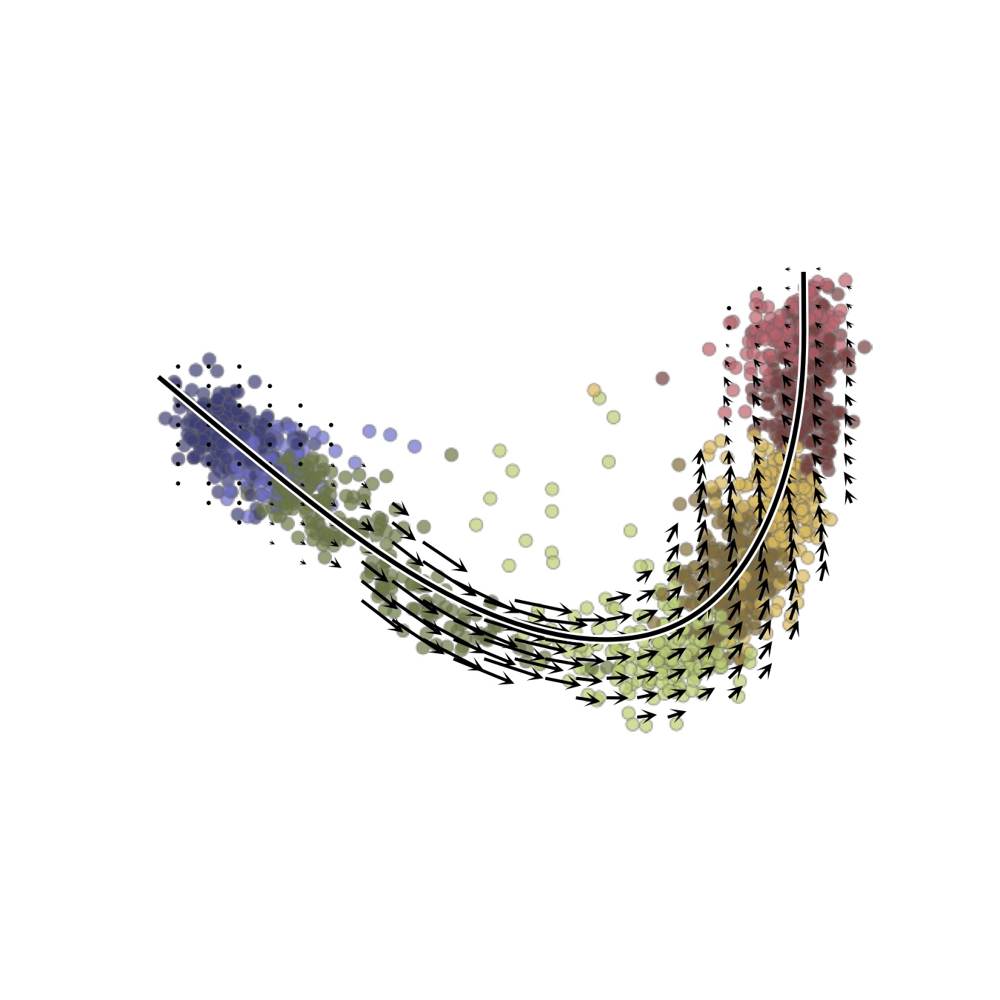



<p align="center">
  <a href="">
    
  </a>
</p>

This tutorial provides instructions for how to pre-process a single-cell RNA-seq dataset with __kallisto &#124; bustools__ to perform an RNA velocity analysis. The tutorial explains the steps using as an example a single-cell RNA-seq experiment of human week 10 fetal forebrain from the [La Manno et al. 2018 paper](https://doi.org/10.1038/s41586-018-0414-6) (accessions SRR6470906 & SRR6470907).

__Note:__ for the instructions, command line arguments are preceeded by`$`. For example, if you see `$ cd my_folder` then type `cd my_folder`.

#### 1. Download the FASTQs
Download the following files:
- [SRR6470906 & SRR6470907 FASTQ Files](https://www.ebi.ac.uk/ena/data/view/PRJNA429950)

```
# SRR6470906
$ wget https://caltech.box.com/shared/static/l3i8nfh2h1yvcze67v3z4uxymnejsvst.gz -O SRR6470906_S1_L001_R1_001.fastq.gz
$ wget https://caltech.box.com/shared/static/3ovi8g86zn21gx37kwors6zvpdrs6d5o.gz -O SRR6470906_S1_L001_R2_001.fastq.gz
$ wget https://caltech.box.com/shared/static/jodgdpfx0mo1g4maj4ry2c2yc24pylew.gz -O SRR6470906_S1_L002_R1_001.fastq.gz
$ wget https://caltech.box.com/shared/static/nmdq64606laubo0fgml09q8k00y9eecz.gz -O SRR6470906_S1_L002_R2_001.fastq.gz
# SRR6470907
$ wget https://caltech.box.com/shared/static/tkgbft2ddfvb6hppqi43qxcs2afmloud.gz -O SRR6470907_S1_L001_R1_001.fastq.gz
$ wget https://caltech.box.com/shared/static/dred8n1abiupxfve83w199a724fi7cqt.gz -O SRR6470907_S1_L001_R2_001.fastq.gz
$ wget https://caltech.box.com/shared/static/3unr4hf94zp2y2r4ddmzjo7fc78v8hhj.gz -O SRR6470907_S1_L002_R1_001.fastq.gz
$ wget https://caltech.box.com/shared/static/fp1pf1dqoizkn93v7t1b0uhje18901cv.gz -O SRR6470907_S1_L002_R2_001.fastq.gz
```
Note that we use the `-O` option for each of these commands because otherwise the filenames will be a random sequence of numbers and letters.

#### 1. Generate velocity matrices for both sets of FASTQs
SRR6470906:
```
$ kb count -i index.idx -g transcripts_to_genes.txt -x 10xv2 -o SRR6470907 \
-c1 cdna_transcripts_to_capture.txt -c2 intron_transcripts_to_capture.txt --lamanno \
SRR6470906_S1_L001_R1_001.fastq.gz \
SRR6470906_S1_L001_R2_001.fastq.gz \
SRR6470906_S1_L002_R1_001.fastq.gz \
SRR6470906_S1_L002_R2_001.fastq.gz
```
SRR6470907:
```
$ kb count -i index.idx -g transcripts_to_genes.txt -x 10xv2 -o SRR6470907 \
-c1 cdna_transcripts_to_capture.txt -c2 intron_transcripts_to_capture.txt --lamanno \
SRR6470907_S1_L001_R1_001.fastq.gz \
SRR6470907_S1_L001_R2_001.fastq.gz \
SRR6470907_S1_L002_R1_001.fastq.gz \
SRR6470907_S1_L002_R2_001.fastq.gz
```

#### 2. Load count matrices into notebook
See [this notebook](https://github.com/BUStools/getting_started/blob/master/velocity_tutorial.ipynb) for how to process the spliced and unspliced count matrices to generate a velocity plot.
