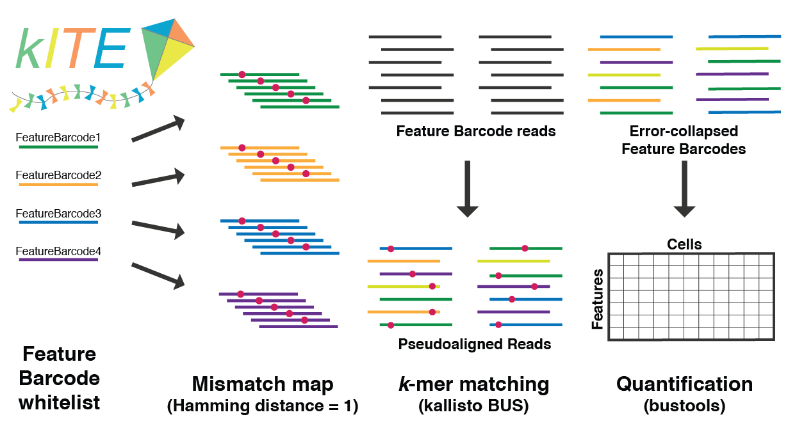



<p align="center">
  <a href="">
    
  </a>
</p>

This page provides instructions for how to use __kallisto &#124; bustools__ to pre-process feature barcoded single-cell RNA-seq experiments. The tutorial explains the steps using as an example the 10x Genomics [pbmc_1k_protein_v3](https://support.10xgenomics.com/single-cell-gene-expression/datasets/3.0.0/pbmc_1k_protein_v3) feature barcoding dataset. A complete notebook showing all steps and analysis can be found [here](https://github.com/pachterlab/kite/blob/master/docs/10x_kiteVignette_20190702.ipynb).

In feature barcoding assays, cellular data are recorded as short DNA sequences using procedures adapted from single-cell RNA-seq. The kITE ("kallisto Indexing and Tag Extraction") workflow involves generating a "Mismatch Map" containing the sequences of all feature barcodes used in the experiment, as well as all of their single-base mismatches. The Mismatch Map is used to make "transcipt-to-gene" (t2g) and "transcriptome" fasta files to be used as inputs for kallisto. An index is made with `kallisto index`, and then  `bustools` is used to search the sequencing data for the sequences in the Mismatch Map. This approach effectively co-opts the __kallisto &#124; bustools__ infrastructure for a different application. 

__Note:__ for the instructions, command line arguments are preceeded by`$`. For example, if you see `$ cd my_folder` then type `cd my_folder`. 

#### 1. Download software and materials
Obtain ```kallisto``` from the [__kallisto__ installation page](https://pachterlab.github.io/kallisto/download), and ```bustools``` from the [__bustools__ installation page](https://github.com/BUStools/bustools).

Prepare a folder and clone the `kite` GitHub repository:
```
$ mkdir kallisto_bustools_kite/
$ cd kallisto_bustools_kite/
$ git clone https://github.com/pachterlab/kite
```
Download the following files:

- [10xPBMC_1k_protein_v3](https://support.10xgenomics.com/single-cell-gene-expression/datasets/3.0.0/pbmc_1k_protein_v3) dataset
- Antibody feature barcode sequences
- 10x Chromium v3 chemistry barcode whitelist 

```
$ wget http://cf.10xgenomics.com/samples/cell-exp/3.0.0/pbmc_1k_protein_v3/pbmc_1k_protein_v3_fastqs.tar
$ tar -xvf ./pbmc_1k_protein_v3_fastqs.tar
$ wget http://cf.10xgenomics.com/samples/cell-exp/3.0.0/pbmc_1k_protein_v3/pbmc_1k_protein_v3_feature_ref.csv
$ wget https://github.com/BUStools/getting_started/releases/download/species_mixing/10xv3_whitelist.txt
```
#### 2. Make the mismatch FASTA and t2g files
Start by preparing a csv-formatted matrix of Feature Barcode names and Feaure Barcode sequences, __including a header__. Do not include any common or constant sequences. For this tutorial, we parsed the feature_ref.csv file provided by 10x to give a properly formatted csv (below). Example code for this step and specifications for a correctly formatted file (FeatureBarcodes.csv) is included in the [kite GitHub repo](https://github.com/pachterlab/kite/tree/master/docs).

|Feature Barcode name|Feature Barcode sequence|
| ------------- | ------------- |
|CD3_TotalSeqB|AACAAGACCCTTGAG|
|CD8a_TotalSeqB|TACCCGTAATAGCGT|
|CD14_TotalSeqB|GAAAGTCAAAGCACT|
|CD15_TotalSeqB|ACGAATCAATCTGTG|
|CD16_TotalSeqB|GTCTTTGTCAGTGCA|
|CD56_TotalSeqB|GTTGTCCGACAATAC|
|CD19_TotalSeqB|TCAACGCTTGGCTAG|
|CD25_TotalSeqB|GTGCATTCAACAGTA|
|CD45RA_TotalSeqB|GATGAGAACAGGTTT|
|CD45RO_TotalSeqB|TGCATGTCATCGGTG|
|PD-1_TotalSeqB|AAGTCGTGAGGCATG|
|TIGIT_TotalSeqB|TGAAGGCTCATTTGT|
|CD127_TotalSeqB|ACATTGACGCAACTA|
|IgG2a_control_TotalSeqB|CTCTATTCAGACCAG|
|IgG1_control_TotalSeqB|ACTCACTGGAGTCTC|
|IgG2b_control_TotalSeqB| ATCACATCGTTGCCA|

<br>

With the FeatureBarcodes.csv file ready,run `featuremap.py`, which creates a mismatch FASTA file and a mismatch t2g file for the experiment. In this case the mismatch file has 782 entries. 

```
$./kite/featuremap/featuremap.py FeatureBarcodes.csv
```

__Note:__ kallisto only accepts odd values for the k-mer length, so if your Feature Barcodes are even in length, add a constant base on either side before running featuremap.py. For example, append an __A__ base to the CD3_TotalSeqB barcode AACAAGACCCTTGAG &rarr; AACAAGACCCTTGAGA

#### 3. Build an index
Build the kallisto index using the mismatch fasta and a k-mer length `-k` equal to the length of the Feature Barcodes:
```
$ kallisto index -i FeaturesMismatch.idx -k 15 ./FeaturesMismatch.fa
```

#### 4. Run kallisto
Pseudoalign the reads:
```
$ kallisto bus -i FeaturesMismatch.idx -o ./ -x 10xv3 -t 4 \
./pbmc_1k_protein_v3_fastqs/pbmc_1k_protein_v3_antibody_fastqs/pbmc_1k_protein_v3_antibody_S2_L001_R1_001.fastq.gz \
./pbmc_1k_protein_v3_fastqs/pbmc_1k_protein_v3_antibody_fastqs/pbmc_1k_protein_v3_antibody_S2_L001_R2_001.fastq.gz \
./pbmc_1k_protein_v3_fastqs/pbmc_1k_protein_v3_antibody_fastqs/pbmc_1k_protein_v3_antibody_S2_L002_R1_001.fastq.gz \
./pbmc_1k_protein_v3_fastqs/pbmc_1k_protein_v3_antibody_fastqs/pbmc_1k_protein_v3_antibody_S2_L002_R2_001.fastq.gz \
```

#### 5. Run bustools
For `bustools count`, use the mismatch t2g file. 
```
$ bustools correct -w ./10xv3_whitelist.txt ./output.bus -o ./output_corrected.bus
```
```
$ bustools sort -t 4 -o ./output_sorted.bus ./output_corrected.bus
```
```
$ mkdir ./featurecounts/
```
```
$ bustools count -o ./featurecounts/featurecounts --genecounts -g ./Features_t2g.txt -e ./matrix.ec -t ./transcripts.txt ./output_sorted.bus
```
#### 6. Load count matrices into notebook
See [this notebook](https://github.com/pachterlab/kite/blob/master/docs/10x_kiteVignette_20190702.ipynb) for how to process the feature count matrix.
