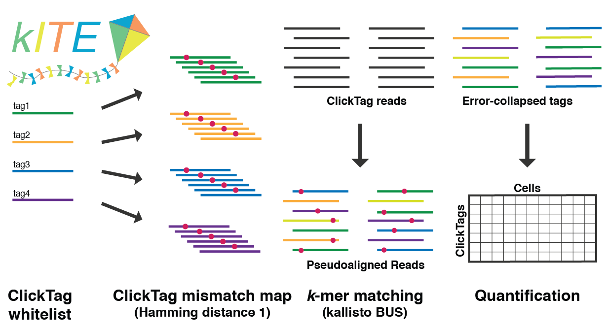



<p align="center">
  <a href="">
    
  </a>
</p>

This page provides instructions for how to use __kallisto &#124; bustools__ to pre-process feature barcoded single-cell RNA-seq experiments. The tutorial explains the steps using as an example the 10x Genomics [pbmc_1k_protein_v3](https://support.10xgenomics.com/single-cell-gene-expression/datasets/3.0.0/pbmc_1k_protein_v3) feature barcoding dataset.

In feature barcoding assays, cellular data are recorded as short DNA sequences using procedures adapted from single-cell RNA-seq. The kITE ("kallisto Indexing and Tag Extraction") workflow involves generating a "Mismatch Map" containing the sequences of all feature barcodes used in the experiment, as well as all of their single-base mismatches. The Mismatch Map is used to produce "transcipt-to-gene" (t2g) and "transcriptome" fasta files to be used as inputs for kallisto. An index is made with `kallisto index`, and then  `bustools` is used to search the sequencing data for the sequences in the Mismatch Map. This approach effectively coopts the __kallisto &#124; bustools__ infrastructure for a different application. 

__Note:__ for the instructions, command line arguments are preceeded by`$`. For example, if you see `$ cd my_folder` then type `cd my_folder`. 

#### 0. Download and install software
Obtain ```kallisto``` from the [__kallisto__ installation page](https://pachterlab.github.io/kallisto/download), and ```bustools``` from the [__bustools__ installation page](https://github.com/BUStools/bustools). The workflow requires the python kite package to be installed:
```
$ git clone https://github.com/pachterlab/kite
$ pip install ./kite
```
Finally, the python program featuremap.py, included in the kite GitHub repository (`./kite/featuremap/featuremap.py`), is needed.

#### 1. Download materials
Prepare a folder:
```
$ mkdir kallisto_bustools_kite/; cd kallisto_bustools_kite/
```
Download the following files:

- [10xPBMC_1k_protein_v3](https://support.10xgenomics.com/single-cell-gene-expression/datasets/3.0.0/pbmc_1k_protein_v3) dataset
- Antibody barcode sequences
- 10x Chromium v3 chemistry barcode whitelist 

```
$ wget http://cf.10xgenomics.com/samples/cell-exp/3.0.0/pbmc_1k_protein_v3/pbmc_1k_protein_v3_fastqs.tar; tar -xvf ./pbmc_1k_protein_v3_fastqs.tar
$ wget http://cf.10xgenomics.com/samples/cell-exp/3.0.0/pbmc_1k_protein_v3/pbmc_1k_protein_v3_feature_ref.csv
$ wget whitelist
```
#### 2. Make the FASTA file
This step creates a FASTA file containing only the feature barcode sequences (no common or constant sequences) and corresponding feature names used in the experiment. In this case, 10x has provided a csv file that is parsed using `get_tags` from the kite package. The object `tags` is the Python feature barocde dictionary.

``` 
$./kite/featuremap/featuremap.py pbmc_1k_protein_v3_feature_ref.csv
```

#### 3. Build Index
Build the species velocity index:
```
$ kallisto index -i FeaturesMismatch.idx -k 15 ./FeaturesMismatch.fa
```

#### 4. Run kallisto
Pseudoalign the reads for 06:
```
$ kallisto bus -i cDNA_intronkallisto bus -i FeaturesMismatch.idx -o ./ -x 10xv3 -t 4 \
./pbmc_1k_protein_v3_fastqs/pbmc_1k_protein_v3_antibody_fastqs/pbmc_1k_protein_v3_antibody_S2_L001_R1_001.fastq.gz \
./pbmc_1k_protein_v3_fastqs/pbmc_1k_protein_v3_antibody_fastqs/pbmc_1k_protein_v3_antibody_S2_L001_R2_001.fastq.gz \
./pbmc_1k_protein_v3_fastqs/pbmc_1k_protein_v3_antibody_fastqs/pbmc_1k_protein_v3_antibody_S2_L002_R1_001.fastq.gz \
./pbmc_1k_protein_v3_fastqs/pbmc_1k_protein_v3_antibody_fastqs/pbmc_1k_protein_v3_antibody_S2_L002_R2_001.fastq.gz \
```

#### 5. Run bustools

```
$ bustools correct -w ./3M-february-2018.txt ./output.bus -o ./output_corrected.bus
```
```
$ bustools sort -t 4 -o ./output_sorted.bus ./output_corrected.bus
```
```
$ mkdir ./featurecounts/
```
```
$ bustools count -o ./featurecounts/featurecounts --genecounts -g ./Features_t2g.txt -e ./matrix.ec -t ./transcripts.txt ./output_sorted.bus
```
#### 6. Load count matrices into notebook
See [this notebook](https://github.com/pachterlab/kite/blob/master/tutorial.ipynb) for how to process the feature count matrix.
