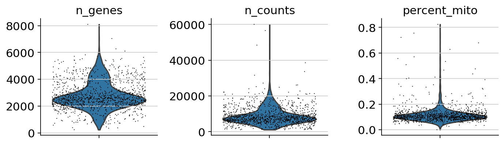

<a href="https://colab.research.google.com/github/pachterlab/kallistobustools/blob/master/notebooks/kb_analysis_0_python.ipynb" target="_parent"></a>

# Analysis of single-cell RNA-seq data: building and annotating an atlas
This Python notebook pre-processes the [pbmc_1k v3 dataset](https://support.10xgenomics.com/single-cell-gene-expression/datasets/3.0.0/pbmc_1k_v3) from 10X Genomics with kallisto and bustools using `kb`, and then performs an analysis of the cell types and their marker genes.

The notebook was written by A. Sina Booeshaghi and Lior Pachter and is based on three noteboks:
- The kallisto | bustools [Introduction to single-cell RNA-seq I](https://colab.research.google.com/github/pachterlab/kallistobustools/blob/master/notebooks/kb_1_minute_intro.ipynb#scrollTo=wtwMjIjjCMcD) notebook.
- The kallisto | bustools [Introduction to single-cell RNA-seq II](https://colab.research.google.com/github/pachterlab/kallistobustools/blob/master/notebooks/kb_standard.ipynb#scrollTo=ijU_u6uj3Sio) notebook.
- The Scanpy [Preprocessing and clustering 3k PBMCs" notebook](https://scanpy-tutorials.readthedocs.io/en/latest/pbmc3k.html).

If you use the methods in this notebook for your analysis please cite the following publications which describe the tools used in the notebook:

* Melsted, P., Booeshaghi, A.S. et al. Modular and efficient pre-processing of single-cell RNA-seq. bioRxiv (2019). doi:10.1101/673285
* Wolf, F. A., Angere, P. and Theis, F.J. SCANPY: large-scale single-cell gene expression data analysis. Genome Biology (2018). doi:10.1186/s13059-017-1382-0

An R notebook implementing the same analysis is available [here](https://colab.research.google.com/github/pachterlab/kallistobustools/blob/master/notebooks/kb_analysis_0_R.ipynb). See the [kallistobus.tools tutorials](https://www.kallistobus.tools/tutorials) site for additional notebooks demonstrating other analyses.

## Setup


```python
# This is  used to time the running of the notebook
import time
start_time = time.time()
```

### Install python packages


```python
%%time
# These packages are pre-installed on Google Colab, but are included here to simplify running this notebook locally
!pip install matplotlib
!pip install scikit-learn
!pip install numpy
!pip install scipy
!pip3 install leidenalg
!pip install louvain
!pip install scanpy
```

    Requirement already satisfied: matplotlib in /usr/local/lib/python3.6/dist-packages (3.0.3)
    Requirement already satisfied: python-dateutil>=2.1 in /usr/local/lib/python3.6/dist-packages (from matplotlib) (2.6.1)
    Requirement already satisfied: cycler>=0.10 in /usr/local/lib/python3.6/dist-packages (from matplotlib) (0.10.0)
    Requirement already satisfied: kiwisolver>=1.0.1 in /usr/local/lib/python3.6/dist-packages (from matplotlib) (1.1.0)
    Requirement already satisfied: numpy>=1.10.0 in /usr/local/lib/python3.6/dist-packages (from matplotlib) (1.17.5)
    Requirement already satisfied: pyparsing!=2.0.4,!=2.1.2,!=2.1.6,>=2.0.1 in /usr/local/lib/python3.6/dist-packages (from matplotlib) (2.4.6)
    Requirement already satisfied: six>=1.5 in /usr/local/lib/python3.6/dist-packages (from python-dateutil>=2.1->matplotlib) (1.12.0)
    Requirement already satisfied: setuptools in /usr/local/lib/python3.6/dist-packages (from kiwisolver>=1.0.1->matplotlib) (45.1.0)
    Requirement already satisfied: scikit-learn in /usr/local/lib/python3.6/dist-packages (0.22.1)
    Requirement already satisfied: joblib>=0.11 in /usr/local/lib/python3.6/dist-packages (from scikit-learn) (0.14.1)
    Requirement already satisfied: scipy>=0.17.0 in /usr/local/lib/python3.6/dist-packages (from scikit-learn) (1.4.1)
    Requirement already satisfied: numpy>=1.11.0 in /usr/local/lib/python3.6/dist-packages (from scikit-learn) (1.17.5)
    Requirement already satisfied: numpy in /usr/local/lib/python3.6/dist-packages (1.17.5)
    Requirement already satisfied: scipy in /usr/local/lib/python3.6/dist-packages (1.4.1)
    Requirement already satisfied: numpy>=1.13.3 in /usr/local/lib/python3.6/dist-packages (from scipy) (1.17.5)
    Requirement already satisfied: leidenalg in /usr/local/lib/python3.6/dist-packages (0.7.0)
    Requirement already satisfied: python-igraph>=0.7.1.0 in /usr/local/lib/python3.6/dist-packages (from leidenalg) (0.7.1.post6)
    Collecting louvain
    [?25l  Downloading https://files.pythonhosted.org/packages/51/bc/8cc9bb51a7fd9d13f37f2d904ee269971bccb1ab0eb06447a539af67f94c/louvain-0.6.1.tar.gz (84kB)
         |████████████████████████████████| 92kB 2.2MB/s 
    [?25hRequirement already satisfied: python-igraph>=0.7.1.0 in /usr/local/lib/python3.6/dist-packages (from louvain) (0.7.1.post6)
    Building wheels for collected packages: louvain
      Building wheel for louvain (setup.py) ... [?25l[?25hdone
      Created wheel for louvain: filename=louvain-0.6.1-cp36-cp36m-linux_x86_64.whl size=1024949 sha256=5addbeb98a4424a3c915fc3e5416a15a41c5b707cefa2f082ccd62d36655d17a
      Stored in directory: /root/.cache/pip/wheels/f2/c3/d4/f7abaf064186d6214ef952bbb72fd6c5136d4b17dbeaeff481
    Successfully built louvain
    Installing collected packages: louvain
    Successfully installed louvain-0.6.1
    Requirement already satisfied: scanpy in /usr/local/lib/python3.6/dist-packages (1.4.5.post3)
    Requirement already satisfied: scipy>=1.3 in /usr/local/lib/python3.6/dist-packages (from scanpy) (1.4.1)
    Requirement already satisfied: seaborn in /usr/local/lib/python3.6/dist-packages (from scanpy) (0.10.0)
    Requirement already satisfied: anndata>=0.6.22.post1 in /usr/local/lib/python3.6/dist-packages (from scanpy) (0.7.1)
    Requirement already satisfied: h5py>=2.10.0 in /usr/local/lib/python3.6/dist-packages (from scanpy) (2.10.0)
    Requirement already satisfied: scikit-learn>=0.21.2 in /usr/local/lib/python3.6/dist-packages (from scanpy) (0.22.1)
    Requirement already satisfied: joblib in /usr/local/lib/python3.6/dist-packages (from scanpy) (0.14.1)
    Requirement already satisfied: tables in /usr/local/lib/python3.6/dist-packages (from scanpy) (3.4.4)
    Requirement already satisfied: umap-learn>=0.3.10 in /usr/local/lib/python3.6/dist-packages (from scanpy) (0.3.10)
    Requirement already satisfied: setuptools-scm in /usr/local/lib/python3.6/dist-packages (from scanpy) (3.4.3)
    Requirement already satisfied: tqdm in /usr/local/lib/python3.6/dist-packages (from scanpy) (4.28.1)
    Requirement already satisfied: statsmodels>=0.10.0rc2 in /usr/local/lib/python3.6/dist-packages (from scanpy) (0.10.2)
    Requirement already satisfied: importlib-metadata>=0.7; python_version < "3.8" in /usr/local/lib/python3.6/dist-packages (from scanpy) (1.5.0)
    Requirement already satisfied: patsy in /usr/local/lib/python3.6/dist-packages (from scanpy) (0.5.1)
    Requirement already satisfied: pandas>=0.21 in /usr/local/lib/python3.6/dist-packages (from scanpy) (0.25.3)
    Requirement already satisfied: networkx in /usr/local/lib/python3.6/dist-packages (from scanpy) (2.4)
    Requirement already satisfied: numba>=0.41.0 in /usr/local/lib/python3.6/dist-packages (from scanpy) (0.47.0)
    Requirement already satisfied: legacy-api-wrap in /usr/local/lib/python3.6/dist-packages (from scanpy) (1.2)
    Requirement already satisfied: packaging in /usr/local/lib/python3.6/dist-packages (from scanpy) (20.1)
    Requirement already satisfied: matplotlib==3.0.* in /usr/local/lib/python3.6/dist-packages (from scanpy) (3.0.3)
    Requirement already satisfied: natsort in /usr/local/lib/python3.6/dist-packages (from scanpy) (5.5.0)
    Requirement already satisfied: numpy>=1.13.3 in /usr/local/lib/python3.6/dist-packages (from scipy>=1.3->scanpy) (1.17.5)
    Requirement already satisfied: six in /usr/local/lib/python3.6/dist-packages (from h5py>=2.10.0->scanpy) (1.12.0)
    Requirement already satisfied: numexpr>=2.5.2 in /usr/local/lib/python3.6/dist-packages (from tables->scanpy) (2.7.1)
    Requirement already satisfied: zipp>=0.5 in /usr/local/lib/python3.6/dist-packages (from importlib-metadata>=0.7; python_version < "3.8"->scanpy) (2.1.0)
    Requirement already satisfied: pytz>=2017.2 in /usr/local/lib/python3.6/dist-packages (from pandas>=0.21->scanpy) (2018.9)
    Requirement already satisfied: python-dateutil>=2.6.1 in /usr/local/lib/python3.6/dist-packages (from pandas>=0.21->scanpy) (2.6.1)
    Requirement already satisfied: decorator>=4.3.0 in /usr/local/lib/python3.6/dist-packages (from networkx->scanpy) (4.4.1)
    Requirement already satisfied: setuptools in /usr/local/lib/python3.6/dist-packages (from numba>=0.41.0->scanpy) (45.1.0)
    Requirement already satisfied: llvmlite>=0.31.0dev0 in /usr/local/lib/python3.6/dist-packages (from numba>=0.41.0->scanpy) (0.31.0)
    Requirement already satisfied: get-version>=2.0.4 in /usr/local/lib/python3.6/dist-packages (from legacy-api-wrap->scanpy) (2.1)
    Requirement already satisfied: pyparsing>=2.0.2 in /usr/local/lib/python3.6/dist-packages (from packaging->scanpy) (2.4.6)
    Requirement already satisfied: kiwisolver>=1.0.1 in /usr/local/lib/python3.6/dist-packages (from matplotlib==3.0.*->scanpy) (1.1.0)
    Requirement already satisfied: cycler>=0.10 in /usr/local/lib/python3.6/dist-packages (from matplotlib==3.0.*->scanpy) (0.10.0)
    CPU times: user 1.38 s, sys: 319 ms, total: 1.7 s
    Wall time: 3min 44s


### Install kb-python


```python
%%time
# install kb
!pip install kb-python 
```

    Collecting kb-python
    [?25l  Downloading https://files.pythonhosted.org/packages/62/c9/2e5b8fa2cd873a23ae1aeb128b33165d6a9387a2f56ea1fafec1d6d32477/kb_python-0.24.4-py3-none-any.whl (35.4MB)
         |████████████████████████████████| 35.4MB 109kB/s 
    [?25hCollecting loompy>=3.0.6
    [?25l  Downloading https://files.pythonhosted.org/packages/36/52/74ed37ae5988522fbf87b856c67c4f80700e6452410b4cd80498c5f416f9/loompy-3.0.6.tar.gz (41kB)
         |████████████████████████████████| 51kB 6.3MB/s 
    [?25hRequirement already satisfied: anndata>=0.6.22.post1 in /usr/local/lib/python3.6/dist-packages (from kb-python) (0.7.1)
    Requirement already satisfied: h5py in /usr/local/lib/python3.6/dist-packages (from loompy>=3.0.6->kb-python) (2.10.0)
    Requirement already satisfied: numpy in /usr/local/lib/python3.6/dist-packages (from loompy>=3.0.6->kb-python) (1.17.5)
    Requirement already satisfied: scipy in /usr/local/lib/python3.6/dist-packages (from loompy>=3.0.6->kb-python) (1.4.1)
    Requirement already satisfied: setuptools in /usr/local/lib/python3.6/dist-packages (from loompy>=3.0.6->kb-python) (45.1.0)
    Requirement already satisfied: numba in /usr/local/lib/python3.6/dist-packages (from loompy>=3.0.6->kb-python) (0.47.0)
    Requirement already satisfied: click in /usr/local/lib/python3.6/dist-packages (from loompy>=3.0.6->kb-python) (7.0)
    Collecting numpy-groupies
    [?25l  Downloading https://files.pythonhosted.org/packages/57/ae/18217b57ba3e4bb8a44ecbfc161ed065f6d1b90c75d404bd6ba8d6f024e2/numpy_groupies-0.9.10.tar.gz (43kB)
         |████████████████████████████████| 51kB 5.5MB/s 
    [?25hRequirement already satisfied: importlib-metadata>=0.7; python_version < "3.8" in /usr/local/lib/python3.6/dist-packages (from anndata>=0.6.22.post1->kb-python) (1.5.0)
    Requirement already satisfied: natsort in /usr/local/lib/python3.6/dist-packages (from anndata>=0.6.22.post1->kb-python) (5.5.0)
    Requirement already satisfied: packaging in /usr/local/lib/python3.6/dist-packages (from anndata>=0.6.22.post1->kb-python) (20.1)
    Requirement already satisfied: pandas>=0.23.0 in /usr/local/lib/python3.6/dist-packages (from anndata>=0.6.22.post1->kb-python) (0.25.3)
    Requirement already satisfied: six in /usr/local/lib/python3.6/dist-packages (from h5py->loompy>=3.0.6->kb-python) (1.12.0)
    Requirement already satisfied: llvmlite>=0.31.0dev0 in /usr/local/lib/python3.6/dist-packages (from numba->loompy>=3.0.6->kb-python) (0.31.0)
    Requirement already satisfied: zipp>=0.5 in /usr/local/lib/python3.6/dist-packages (from importlib-metadata>=0.7; python_version < "3.8"->anndata>=0.6.22.post1->kb-python) (2.1.0)
    Requirement already satisfied: pyparsing>=2.0.2 in /usr/local/lib/python3.6/dist-packages (from packaging->anndata>=0.6.22.post1->kb-python) (2.4.6)
    Requirement already satisfied: python-dateutil>=2.6.1 in /usr/local/lib/python3.6/dist-packages (from pandas>=0.23.0->anndata>=0.6.22.post1->kb-python) (2.6.1)
    Requirement already satisfied: pytz>=2017.2 in /usr/local/lib/python3.6/dist-packages (from pandas>=0.23.0->anndata>=0.6.22.post1->kb-python) (2018.9)
    Building wheels for collected packages: loompy, numpy-groupies
      Building wheel for loompy (setup.py) ... [?25l[?25hdone
      Created wheel for loompy: filename=loompy-3.0.6-cp36-none-any.whl size=47895 sha256=e61df8a6213b5a000a43369313f030375510d6bad2a151051fd24aa4543cf7d1
      Stored in directory: /root/.cache/pip/wheels/f9/a4/90/5a98ad83419732b0fba533b81a2a52ba3dbe230a936ca4cdc9
      Building wheel for numpy-groupies (setup.py) ... [?25l[?25hdone
      Created wheel for numpy-groupies: filename=numpy_groupies-0+unknown-cp36-none-any.whl size=28042 sha256=08f9947469d78f8300adb39bbd625fcc5aff68f4b9950ef9f24254d431cbaddb
      Stored in directory: /root/.cache/pip/wheels/30/ac/83/64d5f9293aeaec63f9539142fc629a41af064cae1b3d8d94aa
    Successfully built loompy numpy-groupies
    Installing collected packages: numpy-groupies, loompy, kb-python
    Successfully installed kb-python-0.24.4 loompy-3.0.6 numpy-groupies-0+unknown
    CPU times: user 353 ms, sys: 89.7 ms, total: 443 ms
    Wall time: 11.7 s


### Download the data


```python
%%time
# Download the data from the 10x website
!wget http://cf.10xgenomics.com/samples/cell-exp/3.0.0/pbmc_1k_v3/pbmc_1k_v3_fastqs.tar

# unpack the downloaded files
!tar -xvf pbmc_1k_v3_fastqs.tar
```

    --2020-02-07 22:13:57--  http://cf.10xgenomics.com/samples/cell-exp/3.0.0/pbmc_1k_v3/pbmc_1k_v3_fastqs.tar
    Resolving cf.10xgenomics.com (cf.10xgenomics.com)... 13.226.113.21, 13.226.113.37, 13.226.113.61, ...
    Connecting to cf.10xgenomics.com (cf.10xgenomics.com)|13.226.113.21|:80... connected.
    HTTP request sent, awaiting response... 200 OK
    Length: 5549312000 (5.2G) [application/x-tar]
    Saving to: ‘pbmc_1k_v3_fastqs.tar’
    
    pbmc_1k_v3_fastqs.t 100%[===================>]   5.17G  33.8MB/s    in 2m 40s  
    
    2020-02-07 22:16:38 (33.1 MB/s) - ‘pbmc_1k_v3_fastqs.tar’ saved [5549312000/5549312000]
    
    pbmc_1k_v3_fastqs/
    pbmc_1k_v3_fastqs/pbmc_1k_v3_S1_L001_R2_001.fastq.gz
    pbmc_1k_v3_fastqs/pbmc_1k_v3_S1_L002_I1_001.fastq.gz
    pbmc_1k_v3_fastqs/pbmc_1k_v3_S1_L001_R1_001.fastq.gz
    pbmc_1k_v3_fastqs/pbmc_1k_v3_S1_L002_R1_001.fastq.gz
    pbmc_1k_v3_fastqs/pbmc_1k_v3_S1_L002_R2_001.fastq.gz
    pbmc_1k_v3_fastqs/pbmc_1k_v3_S1_L001_I1_001.fastq.gz
    CPU times: user 1.87 s, sys: 393 ms, total: 2.26 s
    Wall time: 4min 17s


### Download an index

This data consists of peripheral blood mononuclear cells from a human, so we download the human index.


```python
!kb ref -d human -i index.idx -g t2g.txt -f1 transcriptome.fasta
```

    [2020-02-07 22:18:20,494]    INFO Downloading files for human from https://caltech.box.com/shared/static/v1nm7lpnqz5syh8dyzdk2zs8bglncfib.gz to tmp/v1nm7lpnqz5syh8dyzdk2zs8bglncfib.gz
    [2020-02-07 22:20:56,952]    INFO Extracting files from tmp/v1nm7lpnqz5syh8dyzdk2zs8bglncfib.gz


## Pseudoalignment and counting

### Run kallisto and bustools


```python
%%time
!kb count --h5ad -i index.idx -g t2g.txt -x 10xv3 -o output --filter bustools -t 2 \
pbmc_1k_v3_fastqs/pbmc_1k_v3_S1_L001_R1_001.fastq.gz \
pbmc_1k_v3_fastqs/pbmc_1k_v3_S1_L001_R2_001.fastq.gz \
pbmc_1k_v3_fastqs/pbmc_1k_v3_S1_L002_R1_001.fastq.gz \
pbmc_1k_v3_fastqs/pbmc_1k_v3_S1_L002_R2_001.fastq.gz
```

    [2020-02-07 22:21:43,406]    INFO Generating BUS file from
    [2020-02-07 22:21:43,407]    INFO         pbmc_1k_v3_fastqs/pbmc_1k_v3_S1_L001_R1_001.fastq.gz
    [2020-02-07 22:21:43,407]    INFO         pbmc_1k_v3_fastqs/pbmc_1k_v3_S1_L001_R2_001.fastq.gz
    [2020-02-07 22:21:43,407]    INFO         pbmc_1k_v3_fastqs/pbmc_1k_v3_S1_L002_R1_001.fastq.gz
    [2020-02-07 22:21:43,407]    INFO         pbmc_1k_v3_fastqs/pbmc_1k_v3_S1_L002_R2_001.fastq.gz
    [2020-02-07 22:35:44,867]    INFO Sorting BUS file output/output.bus to tmp/output.s.bus
    [2020-02-07 22:36:18,698]    INFO Whitelist not provided
    [2020-02-07 22:36:18,698]    INFO Copying pre-packaged 10XV3 whitelist to output
    [2020-02-07 22:36:19,918]    INFO Inspecting BUS file tmp/output.s.bus
    [2020-02-07 22:36:37,665]    INFO Correcting BUS records in tmp/output.s.bus to tmp/output.s.c.bus with whitelist output/10xv3_whitelist.txt
    [2020-02-07 22:40:43,336]    INFO Sorting BUS file tmp/output.s.c.bus to output/output.unfiltered.bus
    [2020-02-07 22:40:55,939]    INFO Generating count matrix output/counts_unfiltered/cells_x_genes from BUS file output/output.unfiltered.bus
    [2020-02-07 22:41:04,570]    INFO Converting matrix output/counts_unfiltered/cells_x_genes.mtx to h5ad output/counts_unfiltered/adata.h5ad
    [2020-02-07 22:41:12,718]    INFO Filtering with bustools
    [2020-02-07 22:41:12,719]    INFO Generating whitelist output/filter_barcodes.txt from BUS file output/output.unfiltered.bus
    [2020-02-07 22:41:12,904]    INFO Capturing records from BUS file output/output.unfiltered.bus to tmp/output.filtered.bus with capture list output/filter_barcodes.txt
    [2020-02-07 22:41:15,006]    INFO Sorting BUS file tmp/output.filtered.bus to output/output.filtered.bus
    [2020-02-07 22:41:23,062]    INFO Generating count matrix output/counts_filtered/cells_x_genes from BUS file output/output.filtered.bus
    [2020-02-07 22:41:31,389]    INFO Converting matrix output/counts_filtered/cells_x_genes.mtx to h5ad output/counts_filtered/adata.h5ad
    CPU times: user 6.04 s, sys: 838 ms, total: 6.88 s
    Wall time: 19min 59s


## Basic QC


```python
import numpy as np
import pandas as pd
import scanpy as sc
import anndata
from sklearn.decomposition import TruncatedSVD
import matplotlib
import matplotlib.pyplot as plt

```


```python
sc.settings.verbosity = 3             # verbosity: errors (0), warnings (1), info (2), hints (3)
sc.logging.print_versions()
sc.settings.set_figure_params(dpi=80)
```

    scanpy==1.4.5.post3 anndata==0.7.1 umap==0.3.10 numpy==1.17.5 scipy==1.4.1 pandas==0.25.3 scikit-learn==0.22.1 statsmodels==0.10.2 python-igraph==0.7.1


```python
# load the unfiltered matrix
results_file = 'pbmc1k.h5ad'  # the file that will store the analysis results
adata = anndata.read_h5ad("output/counts_unfiltered/adata.h5ad")
adata.var["gene_id"] = adata.var.index.values

t2g = pd.read_csv("t2g.txt", header=None, names=["tid", "gene_id", "gene_name"], sep="\t")
t2g.index = t2g.gene_id
t2g = t2g.loc[~t2g.index.duplicated(keep='first')]

adata.var["gene_name"] = adata.var.gene_id.map(t2g["gene_name"])
adata.var.index = adata.var["gene_name"]

adata.var_names_make_unique()  # this is unnecessary if using `var_names='gene_ids'` in `sc.read_10x_mtx`
```


```python
adata
```


    AnnData object with n_obs × n_vars = 259615 × 60623 
        var: 'gene_id', 'gene_name'


### Test for library saturation


```python
# Create a plot showing genes detected as a function of UMI counts.
fig, ax = plt.subplots(figsize=(7, 7))

x = np.asarray(adata.X.sum(axis=1))[:,0]
y = np.asarray(np.sum(adata.X>0, axis=1))[:,0]

ax.scatter(x, y, color="green", alpha=0.25)
ax.set_xlabel("UMI Counts")
ax.set_ylabel("Genes Detected")
ax.set_xscale('log')
ax.set_yscale('log')

ax.set_xlim(1)
ax.set_ylim(1)


plt.show()
```


This plot is very misleading, as even the small alpha can't accurately show how many points are stacked at one location (This takes about a minute to run since there are a lot of points)


```python
fig, ax = plt.subplots(figsize=(7,7))

#histogram definition
bins = [1500, 1500] # number of bins

# histogram the data
hh, locx, locy = np.histogram2d(x, y, bins=bins)

# Sort the points by density, so that the densest points are plotted last
z = np.array([hh[np.argmax(a<=locx[1:]),np.argmax(b<=locy[1:])] for a,b in zip(x,y)])
idx = z.argsort()
x2, y2, z2 = x[idx], y[idx], z[idx]


s = ax.scatter(x2, y2, c=z2, cmap='Greens')  
fig.colorbar(s, ax=ax)

ax.set_xscale('log')
ax.set_yscale('log')
ax.set_xlabel("UMI Counts")
ax.set_ylabel("Genes Detected")

ax.set_xlim(1, 10**5)
ax.set_ylim(1, 10**4)

plt.show()
```


### Examine the knee plot

The "knee plot" was introduced in the Drop-seq paper: 
- Macosko et al., [Highly parallel genome-wide expression profiling of individual cells using nanoliter droplets](https://www.cell.com/fulltext/S0092-8674(15)00549-8), 2015. DOI:10.1016/j.cell.2015.05.002

In this plot cells are ordered by the number of UMI counts associated to them (shown on the *x*-axis), and the fraction of droplets with at least that number of cells is shown on the *y*-axis:


```python
#@title Threshold cells according to knee plot { run: "auto", vertical-output: true }
expected_num_cells =  1178#@param {type:"integer"}
knee = np.sort((np.array(adata.X.sum(axis=1))).flatten())[::-1]

fig, ax = plt.subplots(figsize=(10, 7))

ax.loglog(knee, range(len(knee)), linewidth=5, color="g")
ax.axvline(x=knee[expected_num_cells], linewidth=3, color="k")
ax.axhline(y=expected_num_cells, linewidth=3, color="k")

ax.set_xlabel("UMI Counts")
ax.set_ylabel("Set of Barcodes")

plt.grid(True, which="both")
plt.show()
```


## Analysis

It is useful to examine mitochondrial genes, which are important for quality control. [(Lun, McCarthy & Marioni, 2017)](https://master.bioconductor.org/packages/release/workflows/html/simpleSingleCell.html#examining-gene-level-metrics) write that

> High proportions are indicative of poor-quality cells (Islam et al. 2014; Ilicic et al. 2016), possibly because of loss of cytoplasmic RNA from perforated cells. The reasoning is that mitochondria are larger than individual transcript molecules and less likely to escape through tears in the cell membrane.

Note you can also use the function `pp.calculate_qc_metrics` to compute the fraction of mitochondrial genes and additional measures.

Show those genes that yield the highest fraction of counts in each single cells, across all cells.


```python
sc.pl.highest_expr_genes(adata, n_top=20)
```

    normalizing counts per cell
    WARNING: Some cells have total count of genes equal to zero
        finished (0:00:00)


### Filter

Begin by filtering cells according to various criteria. First, a filter for genes and cells based on minimum thresholds:


```python
# Removes cells with less than 1070 umi counts
adata = adata[np.asarray(adata.X.sum(axis=1)).reshape(-1) > 1070]

# Removes genes with 0 umi counts
adata = adata[:, np.asarray(adata.X.sum(axis=0)).reshape(-1) > 0]
```


```python
adata
```


    View of AnnData object with n_obs × n_vars = 1180 × 31837 
        var: 'gene_id', 'gene_name'


```python
sc.pp.filter_cells(adata, min_genes=200)
sc.pp.filter_genes(adata, min_cells=3)
```

    filtered out 5 cells that have less than 200 genes expressed


    Trying to set attribute `.obs` of view, copying.


    filtered out 5884 genes that are detected in less than 3 cells


```python
adata
```


    AnnData object with n_obs × n_vars = 1175 × 25953 
        obs: 'n_genes'
        var: 'gene_id', 'gene_name', 'n_cells'


Next, filter by mitochondrial gene content


```python
mito_genes = adata.var_names.str.startswith('MT-')
# for each cell compute fraction of counts in mito genes vs. all genes
# the `.A1` is only necessary as X is sparse (to transform to a dense array after summing)
adata.obs['percent_mito'] = np.sum(
    adata[:, mito_genes].X, axis=1).A1 / np.sum(adata.X, axis=1).A1
# add the total counts per cell as observations-annotation to adata
adata.obs['n_counts'] = adata.X.sum(axis=1).A1
```

Perform a QC check of the counts post-filtering


```python
sc.pl.violin(adata, ['n_genes', 'n_counts', 'percent_mito'],
             jitter=0.4, multi_panel=True)
```





```python
#examine mitochondrial content 
sc.pl.scatter(adata, x='n_counts', y='percent_mito')
sc.pl.scatter(adata, x='n_counts', y='n_genes')
```


```python
# Create a mask to filter out cells with more than 6500 genes, less than 200 genes or less than 0.2 mitochondrial umi counts
mask = np.logical_or((adata.obs.n_genes < 6500).values, (adata.obs.n_genes > 200).values, (adata.obs.percent_mito < 0.2).values)
```


```python
#filter
adata = adata[mask, :]
```


```python
adata
```


    View of AnnData object with n_obs × n_vars = 1175 × 25953 
        obs: 'n_genes', 'percent_mito', 'n_counts'
        var: 'gene_id', 'gene_name', 'n_cells'


### Normalize counts

Total-count normalize (library-size correct) the data matrix $\mathbf{X}$ to 10,000 reads per cell, so that counts become comparable among cells.


```python
# normalize counts in each cell to be equal
sc.pp.normalize_total(adata, target_sum=10**4)
```

    normalizing counts per cell
        finished (0:00:02)


Log the counts


```python
# Replace raw counts with their logarithm
sc.pp.log1p(adata)
```

    /usr/local/lib/python3.6/dist-packages/scanpy/preprocessing/_simple.py:298: UserWarning: Revieved a view of an AnnData. Making a copy.
      view_to_actual(data)


Lets now look at the highest expressed genes after filtering, normalization, and log


```python
sc.pl.highest_expr_genes(adata, n_top=20)
```

    normalizing counts per cell
        finished (0:00:00)


Set the `.raw` attribute of AnnData object to the normalized and logarithmized raw gene expression for later use in differential testing and visualizations of gene expression. This simply freezes the state of the AnnData object.

The unnormalized data is stored in `.raw`.


```python
adata.raw = adata
```

<div class="alert alert-info">

**Note**
The result of the following highly-variable-genes detection is stored as an annotation in `.var.highly_variable` and auto-detected by PCA and hence, `sc.pp.neighbors` and subsequent manifold/graph tools.

</div>

### Identify highly-variable genes.


```python
# flavor="cell_ranger" is consistent with Seurat and flavor="suerat" is not consistent with Seurat
sc.pp.highly_variable_genes(adata, min_mean=0.01, max_mean=8, min_disp=1, n_top_genes=2000, flavor="cell_ranger", n_bins=20)
```

    extracting highly variable genes
    If you pass `n_top_genes`, all cutoffs are ignored.
        finished (0:00:01)


```python
sc.pl.highly_variable_genes(adata)
```


Regress out effects of total counts per cell and the percentage of mitochondrial genes expressed. Scale the data to unit variance.

We do not regress out as per https://github.com/theislab/scanpy/issues/526


```python
# sc.pp.regress_out(adata, ['n_counts', 'percent_mito'])
```

### Scaling the data
Scale each gene to unit variance. Clip values exceeding standard deviation 10. 


```python
sc.pp.scale(adata, max_value=10)
```

### Principal component analysis

Reduce the dimensionality of the data by running principal component analysis (PCA), which reveals the main axes of variation and denoises the data.


```python
# We perform PCA on just the highly variable genes
sc.tl.pca(adata, svd_solver='arpack', use_highly_variable=True)
```

    computing PCA with n_comps = 50
        on highly variable genes
        finished (0:00:00)


```python
sc.pl.pca(adata, color='CST3')
```


Let us inspect the contribution of single PCs to the total variance in the data. This gives us information about how many PCs we should consider in order to compute the neighborhood relations of cells, e.g. used in the clustering function  `sc.tl.leiden()` or tSNE `sc.tl.tsne()`. In our experience, often, a rough estimate of the number of PCs does fine.


```python
sc.pl.pca_variance_ratio(adata, log=True)
```


Save the result if you'd like.


```python
!mkdir write
```

    mkdir: cannot create directory ‘write’: File exists


```python
adata.write(results_file)
```


```python
adata
```


    AnnData object with n_obs × n_vars = 1175 × 25953 
        obs: 'n_genes', 'percent_mito', 'n_counts'
        var: 'gene_id', 'gene_name', 'n_cells', 'highly_variable', 'means', 'dispersions', 'dispersions_norm'
        uns: 'log1p', 'pca'
        obsm: 'X_pca'
        varm: 'PCs'


### Compute the neighborhood graph

Next we compute the neighborhood graph of cells using the PCA representation of the data matrix. You might simply use default values here. In order to be consistent with Seurat's results, we use the following values.


```python
sc.pp.neighbors(adata, n_neighbors=20, n_pcs=10)
```

    computing neighbors
        using 'X_pca' with n_pcs = 10
        finished (0:00:00)


### Embed the neighborhood graph

### UMAP

UMAP (UMAP: Uniform Manifold Approximation and Projection for Dimension Reduction) is a manifold learning technique that can also be used to visualize cells. It was published in:

- McInnes, Leland, John Healy, and James Melville. "Umap: Uniform manifold approximation and projection for dimension reduction." arXiv preprint arXiv:1802.03426 (2018).

We run that to visualize the results:

```
tl.paga(adata)
pl.paga(adata, plot=False)  # remove `plot=False` if you want to see the coarse-grained graph
tl.umap(adata, init_pos='paga')
```


```python
sc.tl.umap(adata)
```

    computing UMAP
        finished (0:00:03)


```python
sc.pl.umap(adata, color=['CST3', 'NKG7', 'PPBP'])
```


### Cluster the neighborhood graph

### Clustering

There are many algorithms for clustering cells, and while they have been compared in detail in various benchmarks (see e.g., [Duo et al. 2018](https://f1000research.com/articles/7-1141/v2)), there is no univerally agreed upon method. Here we demonstrate clustering using [Louvain clustering](https://en.wikipedia.org/wiki/Louvain_modularity), which is a popular method for clustering single-cell RNA-seq data. The method was published in 

- Blondel, Vincent D; Guillaume, Jean-Loup; Lambiotte, Renaud; Lefebvre, Etienne (9 October 2008). "Fast unfolding of communities in large networks". Journal of Statistical Mechanics: Theory and Experiment. 2008 (10): P10008.

Note that Louvain clustering directly clusters the neighborhood graph of cells, which we already computed in the previous section.


```python
sc.tl.louvain(adata,resolution=0.5, random_state=42)
```

    running Louvain clustering
        using the "louvain" package of Traag (2017)
        finished (0:00:00)


A plot of the clusters is shown below:


```python
sc.pl.umap(adata, color=['louvain', 'CST3', 'NKG7'])
```


Save the result.


```python
adata.write(results_file)
```

### Find marker genes

A key aspect of annotating a cell atlas is identifying "marker genes". These are genes specific to individual clusters that "mark" them, and are important both for assigning functions to cell clusters, and for designing downstream experiments to probe activity of clusters. 

A gene marker analysis begins with ranking genes in each cluster according to how different they are relative to other clusters. Typically the t-test is used for this purpose.


```python
sc.tl.rank_genes_groups(adata, 'louvain', method='t-test', corr_method="bonferroni")
sc.pl.rank_genes_groups(adata, n_genes=25, sharey=False)
```

    ranking genes
        finished (0:00:00)


```python
sc.settings.verbosity = 2  # reduce the verbosity
```

An alternative to the parametric t-test is the non-parametric [Wilcoxon rank-sum (Mann-Whitney-U)](https://de.wikipedia.org/wiki/Wilcoxon-Mann-Whitney-Test) test.


```python
sc.tl.rank_genes_groups(adata, 'louvain', method='wilcoxon', corr_method="bonferroni")
sc.pl.rank_genes_groups(adata, n_genes=25, sharey=False)
```

    ranking genes
        finished (0:00:02)


Save the result.


```python
adata.write(results_file)
```

As an alternative, genes can be ranked using logistic regression (see [Natranos et al. (2018)](https://doi.org/10.1101/258566)).


```python
sc.tl.rank_genes_groups(adata, 'louvain', method='logreg')
sc.pl.rank_genes_groups(adata, n_genes=25, sharey=False)
```

    ranking genes
        finished (0:00:15)


    /usr/local/lib/python3.6/dist-packages/sklearn/linear_model/_logistic.py:940: ConvergenceWarning: lbfgs failed to converge (status=1):
    STOP: TOTAL NO. of ITERATIONS REACHED LIMIT.
    
    Increase the number of iterations (max_iter) or scale the data as shown in:
        https://scikit-learn.org/stable/modules/preprocessing.html
    Please also refer to the documentation for alternative solver options:
        https://scikit-learn.org/stable/modules/linear_model.html#logistic-regression
      extra_warning_msg=_LOGISTIC_SOLVER_CONVERGENCE_MSG)


With the exceptions of *IL7R*, which is only found by the t-test and *FCER1A*, which is only found by the other two appraoches, all marker genes are recovered in all approaches.

Louvain Group | Markers | Cell Type
---|---|---
0 | IL7R | CD4 T cells
1 | CD14, LYZ | CD14+ Monocytes
2 | MS4A1 |	B cells
3 | GNLY, NKG7 | 	NK cells
4 | FCGR3A, MS4A7 |	FCGR3A+ Monocytes
5 | CD8A |	CD8 T cells
6 | MS4A1 |	B cells

Let us also define a list of marker genes for later reference.


```python
marker_genes = ['IL7R', 'CD79A', 'MS4A1', 'CD8A', 'CD8B', 'LYZ', 'CD14',
                'LGALS3', 'S100A8', 'GNLY', 'NKG7', 'KLRB1',  
                'FCGR3A', 'MS4A7', 'FCER1A', 'CST3', 'PPBP']
```

Reload the object that has been save with the Wilcoxon Rank-Sum test result.


```python
adata = sc.read(results_file)
```

Show the 10 top ranked genes per cluster 0, 1, ..., 7 in a dataframe.


```python
pd.DataFrame(adata.uns['rank_genes_groups']['names']).head(5)
```


<div>
<style scoped>
    .dataframe tbody tr th:only-of-type {
        vertical-align: middle;
    }

    .dataframe tbody tr th {
        vertical-align: top;
    }

    .dataframe thead th {
        text-align: right;
    }
</style>
<table border="1" class="dataframe">
  <thead>
    <tr style="text-align: right;">
      <th></th>
      <th>0</th>
      <th>1</th>
      <th>2</th>
      <th>3</th>
      <th>4</th>
      <th>5</th>
      <th>6</th>
    </tr>
  </thead>
  <tbody>
    <tr>
      <th>0</th>
      <td>LDHB</td>
      <td>S100A8</td>
      <td>IGHD</td>
      <td>NKG7</td>
      <td>CST3</td>
      <td>KLRB1</td>
      <td>CD79A</td>
    </tr>
    <tr>
      <th>1</th>
      <td>RPS15A</td>
      <td>S100A9</td>
      <td>IGHM</td>
      <td>CTSW</td>
      <td>HLA-DPA1</td>
      <td>KLRG1</td>
      <td>IGKC</td>
    </tr>
    <tr>
      <th>2</th>
      <td>RPS12</td>
      <td>VCAN</td>
      <td>CD37</td>
      <td>GZMA</td>
      <td>NPC2</td>
      <td>NKG7</td>
      <td>CD79B</td>
    </tr>
    <tr>
      <th>3</th>
      <td>TRAC</td>
      <td>S100A12</td>
      <td>MS4A1</td>
      <td>CST7</td>
      <td>HLA-DPB1</td>
      <td>IL32</td>
      <td>BANK1</td>
    </tr>
    <tr>
      <th>4</th>
      <td>RPS14</td>
      <td>MNDA</td>
      <td>CD79A</td>
      <td>GZMM</td>
      <td>FCER1G</td>
      <td>GZMA</td>
      <td>TNFRSF13C</td>
    </tr>
  </tbody>
</table>
</div>


Get a table with the scores and groups.


```python
result = adata.uns['rank_genes_groups']
groups = result['names'].dtype.names
pd.DataFrame(
    {group + '_' + key[:1]: result[key][group]
    for group in groups for key in ['names', 'pvals']}).head(5)
```


<div>
<style scoped>
    .dataframe tbody tr th:only-of-type {
        vertical-align: middle;
    }

    .dataframe tbody tr th {
        vertical-align: top;
    }

    .dataframe thead th {
        text-align: right;
    }
</style>
<table border="1" class="dataframe">
  <thead>
    <tr style="text-align: right;">
      <th></th>
      <th>0_n</th>
      <th>0_p</th>
      <th>1_n</th>
      <th>1_p</th>
      <th>2_n</th>
      <th>2_p</th>
      <th>3_n</th>
      <th>3_p</th>
      <th>4_n</th>
      <th>4_p</th>
      <th>5_n</th>
      <th>5_p</th>
      <th>6_n</th>
      <th>6_p</th>
    </tr>
  </thead>
  <tbody>
    <tr>
      <th>0</th>
      <td>LDHB</td>
      <td>4.516461e-132</td>
      <td>S100A8</td>
      <td>7.505366e-142</td>
      <td>IGHD</td>
      <td>5.910498e-75</td>
      <td>NKG7</td>
      <td>7.071959e-53</td>
      <td>CST3</td>
      <td>2.017979e-41</td>
      <td>KLRB1</td>
      <td>8.274802e-41</td>
      <td>CD79A</td>
      <td>9.836008e-29</td>
    </tr>
    <tr>
      <th>1</th>
      <td>RPS15A</td>
      <td>1.541380e-110</td>
      <td>S100A9</td>
      <td>2.081678e-141</td>
      <td>IGHM</td>
      <td>6.105155e-75</td>
      <td>CTSW</td>
      <td>2.574017e-49</td>
      <td>HLA-DPA1</td>
      <td>7.445143e-41</td>
      <td>KLRG1</td>
      <td>1.245774e-34</td>
      <td>IGKC</td>
      <td>1.367137e-27</td>
    </tr>
    <tr>
      <th>2</th>
      <td>RPS12</td>
      <td>2.055162e-109</td>
      <td>VCAN</td>
      <td>2.450077e-137</td>
      <td>CD37</td>
      <td>8.870612e-74</td>
      <td>GZMA</td>
      <td>3.949175e-48</td>
      <td>NPC2</td>
      <td>3.832086e-32</td>
      <td>NKG7</td>
      <td>7.556990e-32</td>
      <td>CD79B</td>
      <td>1.478383e-25</td>
    </tr>
    <tr>
      <th>3</th>
      <td>TRAC</td>
      <td>1.822762e-105</td>
      <td>S100A12</td>
      <td>4.398791e-137</td>
      <td>MS4A1</td>
      <td>1.132038e-70</td>
      <td>CST7</td>
      <td>2.486254e-45</td>
      <td>HLA-DPB1</td>
      <td>5.624248e-32</td>
      <td>IL32</td>
      <td>1.135243e-30</td>
      <td>BANK1</td>
      <td>2.175950e-25</td>
    </tr>
    <tr>
      <th>4</th>
      <td>RPS14</td>
      <td>1.821569e-104</td>
      <td>MNDA</td>
      <td>2.535172e-133</td>
      <td>CD79A</td>
      <td>1.022589e-69</td>
      <td>GZMM</td>
      <td>5.408959e-42</td>
      <td>FCER1G</td>
      <td>1.910180e-31</td>
      <td>GZMA</td>
      <td>1.885113e-30</td>
      <td>TNFRSF13C</td>
      <td>2.332597e-24</td>
    </tr>
  </tbody>
</table>
</div>


Compare to a single cluster. 


```python
sc.tl.rank_genes_groups(adata, 'louvain', groups=['0'], reference='1', method='wilcoxon')
sc.pl.rank_genes_groups(adata, groups=['0'], n_genes=20)
```

    ranking genes
        finished (0:00:01)


If we want a more detailed view for a certain group, use `sc.pl.rank_genes_groups_violin`.


```python
sc.pl.rank_genes_groups_violin(adata, groups='0', n_genes=8)
```


Reload the object that computed differential expression by comparing to the rest of the groups.


```python
adata = sc.read(results_file)
```


```python
sc.pl.rank_genes_groups_violin(adata, groups='0', n_genes=8)
```


If you want to compare a certain gene across groups, use the following.


```python
sc.pl.violin(adata, marker_genes, groupby='louvain')
```


Actually mark the cell types.


```python
# Each cluster (index in the list) corresponds to a cell type
new_cluster_names = [
                     "CD4 T",
                     "CD14 Monocytes",
                     "B-1",
                     "NK",
                     "FCGR3A Monocytes",
                     "CD8 T",
                     "B-2"
]
```


```python
 adata.rename_categories('louvain', new_cluster_names)
```


```python
sc.pl.umap(adata, color='louvain', legend_loc='on data', title='', frameon=False)
```


Now that we annotated the cell types, let us visualize the marker genes.


```python
ax = sc.pl.dotplot(adata, marker_genes, groupby='louvain')
```


There is also a very compact violin plot.


```python
ax = sc.pl.stacked_violin(adata, marker_genes, groupby='louvain', rotation=90)
```


Note that as a result of the analysis the adata object has accumulated several annotations:


```python
adata
```


    AnnData object with n_obs × n_vars = 1175 × 25953 
        obs: 'n_genes', 'percent_mito', 'n_counts', 'louvain'
        var: 'gene_id', 'gene_name', 'n_cells', 'highly_variable', 'means', 'dispersions', 'dispersions_norm'
        uns: 'louvain', 'louvain_colors', 'neighbors', 'pca', 'rank_genes_groups', 'umap'
        obsm: 'X_pca', 'X_umap'
        varm: 'PCs'


```python
adata.write(results_file, compression='gzip')  # `compression='gzip'` saves disk space, but slows down writing and subsequent reading
```

Get a rough overview of the file using `h5ls`, which has many options - for more details see [here](https://github.com/theislab/scanpy_usage/blob/master/170505_seurat/info_h5ad.md). The file format might still be subject to further optimization in the future. All reading functions will remain backwards-compatible, though.

If you want to export to "csv", you have the following options:


```python
# Export single fields of the annotation of observations
# adata.obs[['n_counts', 'louvain_groups']].to_csv(
#     './write/pbmc3k_corrected_louvain_groups.csv')

# Export single columns of the multidimensional annotation
# adata.obsm.to_df()[['X_pca1', 'X_pca2']].to_csv(
#     './write/pbmc3k_corrected_X_pca.csv')

# Or export everything except the data using `.write_csvs`.
# Set `skip_data=False` if you also want to export the data.
# adata.write_csvs(results_file[:-5], )
```


```python
# Running time of the notebook
print("{:.2f} minutes".format((time.time()-start_time)/60))
```

    32.21 minutes


**Feedback**: please report any issues, or submit pull requests for improvements, in the [Github repository where this notebook is located](https://github.com/pachterlab/kallistobustools/blob/master/notebooks/kb_analysis_0_python.ipynb).
