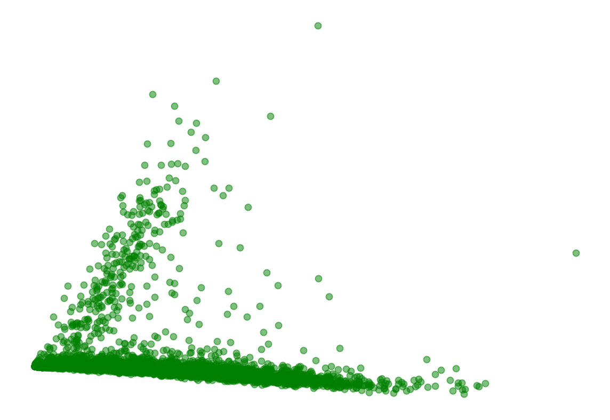
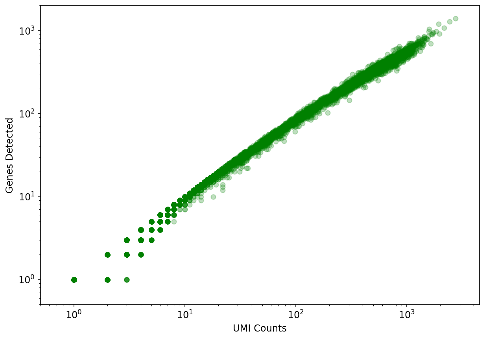
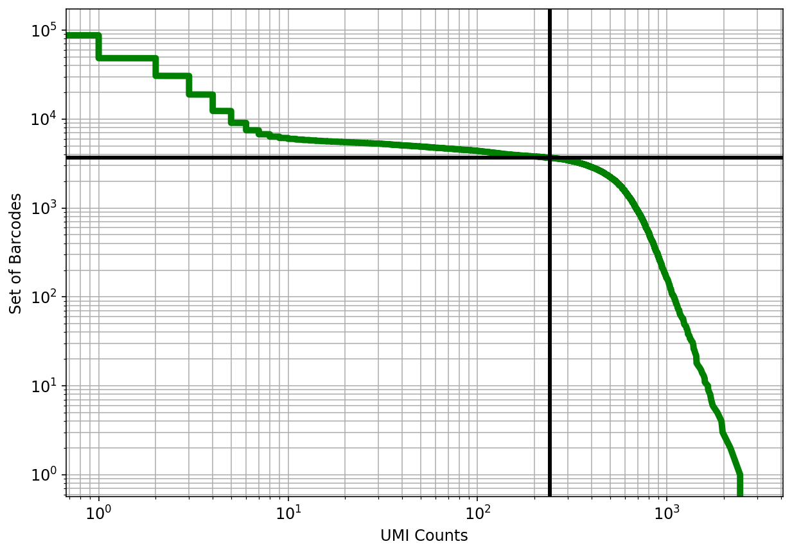
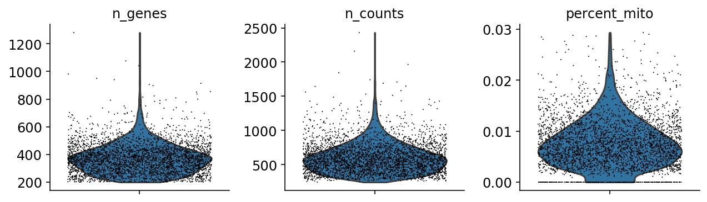
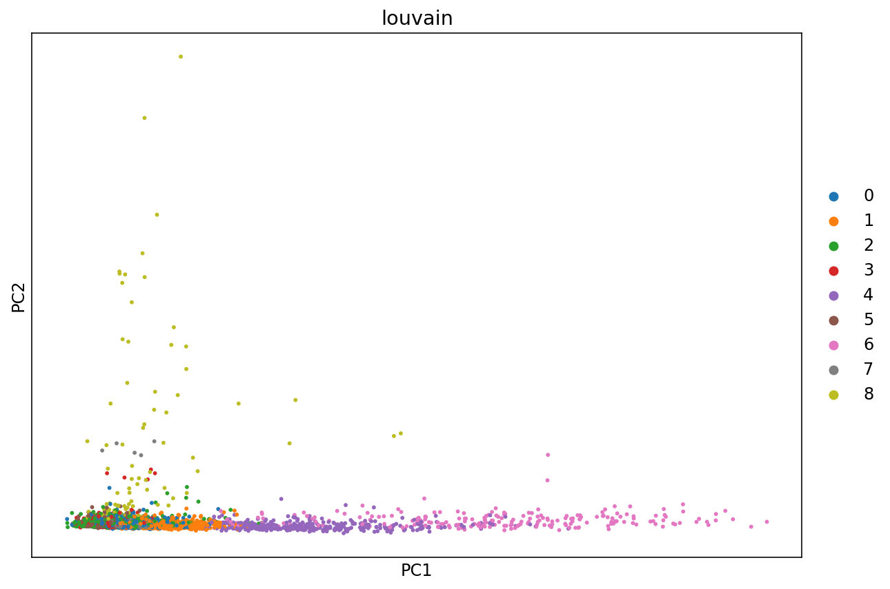
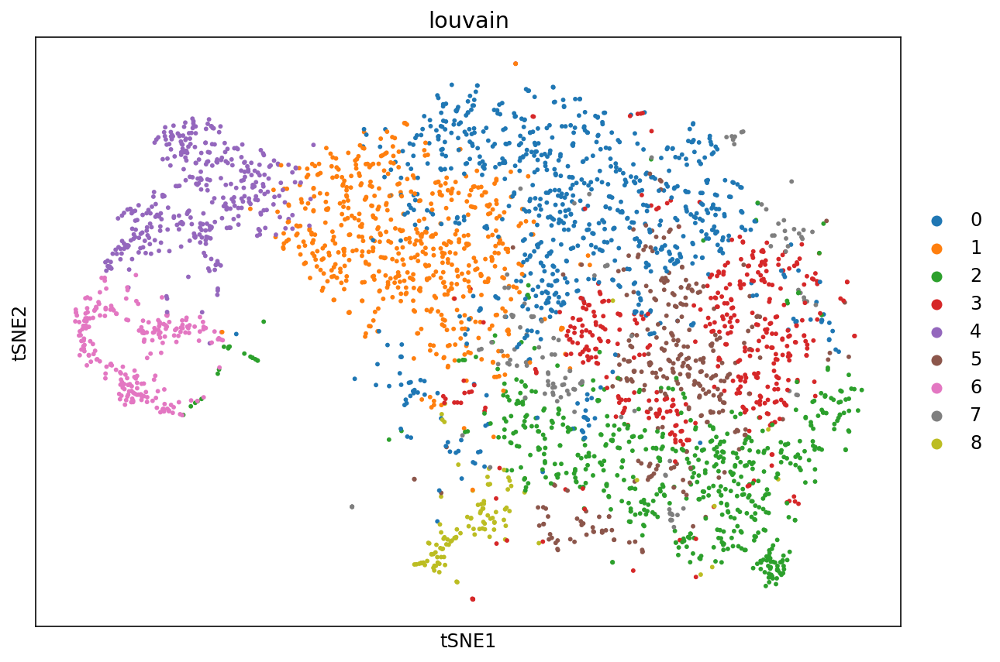
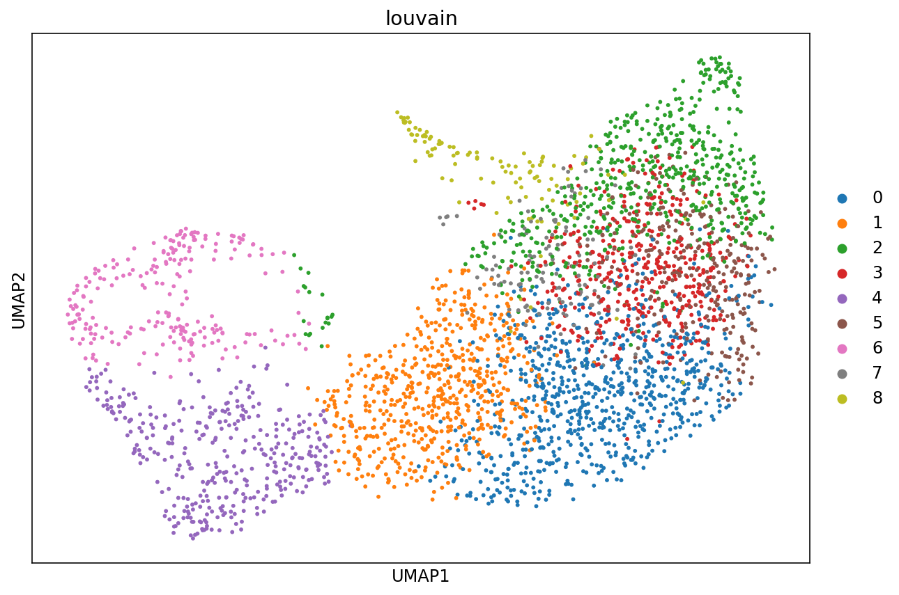

<a href="https://colab.research.google.com/github/pachterlab/kallistobustools/blob/master/notebooks/kb_intro_2_python.ipynb" target="_parent"></a>

# Introduction to single-cell RNA-seq II: getting started with analysis

This notebook demonstrates pre-processing and basic analysis of the [mouse retinal cells GSE126783](https://www.ncbi.nlm.nih.gov/geo/query/acc.cgi?acc=GSE126783) dataset from [Koren et al., 2019](https://doi.org/10.1016/j.immuni.2019.02.007). Following pre-processing using kallisto and bustools and basic QC, the notebook demonstrates some initial analysis. The approximate running time of the notebook is about 13 minutes.

The notebook was written by Kyung Hoi (Joseph) Min, A. Sina Booeshaghi and Lior Pachter. If you use the methods in this notebook for your analysis please cite the following publications which describe the tools used in the notebook, as well as specific methods they run (these are cited inline in the notebook):

* Melsted, P., Booeshaghi, A.S. et al. Modular and efficient pre-processing of single-cell RNA-seq. bioRxiv (2019). doi:10.1101/673285
* Wolf, F. A., Angere, P. and Theis, F.J. SCANPY: large-scale single-cell gene expression data analysis. Genome Biology (2018). doi:10.1186/s13059-017-1382-0

An R notebook implementing the same analysis is available [here](https://colab.research.google.com/github/pachterlab/kallistobustools/blob/master/notebooks/kb_intro_2_R.ipynb). See the [kallistobus.tools tutorials](https://www.kallistobus.tools/tutorials) site for additional notebooks demonstrating other analyses.


## Setup


```
# This is  used to time the running of the notebook
import time
start_time = time.time()
```

### Install python packages


```
# These packages are pre-installed on Google Colab, but are included here to facilitate running this notebook locally
!pip install matplotlib
!pip install scikit-learn
!pip install numpy
!pip install scipy
```

    Requirement already satisfied: matplotlib in /usr/local/lib/python3.6/dist-packages (3.1.3)
    Requirement already satisfied: python-dateutil>=2.1 in /usr/local/lib/python3.6/dist-packages (from matplotlib) (2.6.1)
    Requirement already satisfied: pyparsing!=2.0.4,!=2.1.2,!=2.1.6,>=2.0.1 in /usr/local/lib/python3.6/dist-packages (from matplotlib) (2.4.6)
    Requirement already satisfied: cycler>=0.10 in /usr/local/lib/python3.6/dist-packages (from matplotlib) (0.10.0)
    Requirement already satisfied: kiwisolver>=1.0.1 in /usr/local/lib/python3.6/dist-packages (from matplotlib) (1.1.0)
    Requirement already satisfied: numpy>=1.11 in /usr/local/lib/python3.6/dist-packages (from matplotlib) (1.17.5)
    Requirement already satisfied: six>=1.5 in /usr/local/lib/python3.6/dist-packages (from python-dateutil>=2.1->matplotlib) (1.12.0)
    Requirement already satisfied: setuptools in /usr/local/lib/python3.6/dist-packages (from kiwisolver>=1.0.1->matplotlib) (45.1.0)
    Requirement already satisfied: scikit-learn in /usr/local/lib/python3.6/dist-packages (0.22.1)
    Requirement already satisfied: numpy>=1.11.0 in /usr/local/lib/python3.6/dist-packages (from scikit-learn) (1.17.5)
    Requirement already satisfied: scipy>=0.17.0 in /usr/local/lib/python3.6/dist-packages (from scikit-learn) (1.4.1)
    Requirement already satisfied: joblib>=0.11 in /usr/local/lib/python3.6/dist-packages (from scikit-learn) (0.14.1)
    Requirement already satisfied: numpy in /usr/local/lib/python3.6/dist-packages (1.17.5)
    Requirement already satisfied: scipy in /usr/local/lib/python3.6/dist-packages (1.4.1)
    Requirement already satisfied: numpy>=1.13.3 in /usr/local/lib/python3.6/dist-packages (from scipy) (1.17.5)


```
%%time
# `kb` is a wrapper for the kallisto and bustools program, and the kb-python package contains the kallisto and bustools executables.
!pip install kb-python==0.24.1
```

    Collecting kb-python==0.24.1
    [?25l  Downloading https://files.pythonhosted.org/packages/f3/c5/bee3f312c13d0bf0cce77efb44fa47312ec0bc5d7ecc971b295128d61bd8/kb_python-0.24.1-py3-none-any.whl (35.4MB)
         |████████████████████████████████| 35.4MB 78kB/s 
    [?25hCollecting loompy>=3.0.6
    [?25l  Downloading https://files.pythonhosted.org/packages/36/52/74ed37ae5988522fbf87b856c67c4f80700e6452410b4cd80498c5f416f9/loompy-3.0.6.tar.gz (41kB)
         |████████████████████████████████| 51kB 6.7MB/s 
    [?25hCollecting anndata>=0.6.22.post1
    [?25l  Downloading https://files.pythonhosted.org/packages/5b/c8/5c594a95ba293433dfe1cf188075ccbabe495bf2d291be744974aca85ffc/anndata-0.7.1-py3-none-any.whl (97kB)
         |████████████████████████████████| 102kB 11.7MB/s 
    [?25hRequirement already satisfied: h5py in /usr/local/lib/python3.6/dist-packages (from loompy>=3.0.6->kb-python==0.24.1) (2.8.0)
    Requirement already satisfied: numpy in /usr/local/lib/python3.6/dist-packages (from loompy>=3.0.6->kb-python==0.24.1) (1.17.5)
    Requirement already satisfied: scipy in /usr/local/lib/python3.6/dist-packages (from loompy>=3.0.6->kb-python==0.24.1) (1.4.1)
    Requirement already satisfied: setuptools in /usr/local/lib/python3.6/dist-packages (from loompy>=3.0.6->kb-python==0.24.1) (45.1.0)
    Requirement already satisfied: numba in /usr/local/lib/python3.6/dist-packages (from loompy>=3.0.6->kb-python==0.24.1) (0.47.0)
    Requirement already satisfied: click in /usr/local/lib/python3.6/dist-packages (from loompy>=3.0.6->kb-python==0.24.1) (7.0)
    Collecting numpy-groupies
    [?25l  Downloading https://files.pythonhosted.org/packages/57/ae/18217b57ba3e4bb8a44ecbfc161ed065f6d1b90c75d404bd6ba8d6f024e2/numpy_groupies-0.9.10.tar.gz (43kB)
         |████████████████████████████████| 51kB 8.7MB/s 
    [?25hRequirement already satisfied: packaging in /usr/local/lib/python3.6/dist-packages (from anndata>=0.6.22.post1->kb-python==0.24.1) (20.1)
    Requirement already satisfied: pandas>=0.23.0 in /usr/local/lib/python3.6/dist-packages (from anndata>=0.6.22.post1->kb-python==0.24.1) (0.25.3)
    Requirement already satisfied: importlib-metadata>=0.7; python_version < "3.8" in /usr/local/lib/python3.6/dist-packages (from anndata>=0.6.22.post1->kb-python==0.24.1) (1.5.0)
    Requirement already satisfied: natsort in /usr/local/lib/python3.6/dist-packages (from anndata>=0.6.22.post1->kb-python==0.24.1) (5.5.0)
    Requirement already satisfied: six in /usr/local/lib/python3.6/dist-packages (from h5py->loompy>=3.0.6->kb-python==0.24.1) (1.12.0)
    Requirement already satisfied: llvmlite>=0.31.0dev0 in /usr/local/lib/python3.6/dist-packages (from numba->loompy>=3.0.6->kb-python==0.24.1) (0.31.0)
    Requirement already satisfied: pyparsing>=2.0.2 in /usr/local/lib/python3.6/dist-packages (from packaging->anndata>=0.6.22.post1->kb-python==0.24.1) (2.4.6)
    Requirement already satisfied: python-dateutil>=2.6.1 in /usr/local/lib/python3.6/dist-packages (from pandas>=0.23.0->anndata>=0.6.22.post1->kb-python==0.24.1) (2.6.1)
    Requirement already satisfied: pytz>=2017.2 in /usr/local/lib/python3.6/dist-packages (from pandas>=0.23.0->anndata>=0.6.22.post1->kb-python==0.24.1) (2018.9)
    Requirement already satisfied: zipp>=0.5 in /usr/local/lib/python3.6/dist-packages (from importlib-metadata>=0.7; python_version < "3.8"->anndata>=0.6.22.post1->kb-python==0.24.1) (2.1.0)
    Building wheels for collected packages: loompy, numpy-groupies
      Building wheel for loompy (setup.py) ... [?25l[?25hdone
      Created wheel for loompy: filename=loompy-3.0.6-cp36-none-any.whl size=47895 sha256=c82b8c1974d6f3246a3a977aa8388a16f3b1dd072ee1115a2bfd8bf50bbb95bd
      Stored in directory: /root/.cache/pip/wheels/f9/a4/90/5a98ad83419732b0fba533b81a2a52ba3dbe230a936ca4cdc9
      Building wheel for numpy-groupies (setup.py) ... [?25l[?25hdone
      Created wheel for numpy-groupies: filename=numpy_groupies-0+unknown-cp36-none-any.whl size=28042 sha256=514c8310b68ca43b2f5e3fc1acb219459c229675b39bf9d02708d4d609fc7c96
      Stored in directory: /root/.cache/pip/wheels/30/ac/83/64d5f9293aeaec63f9539142fc629a41af064cae1b3d8d94aa
    Successfully built loompy numpy-groupies
    Installing collected packages: numpy-groupies, loompy, anndata, kb-python
    Successfully installed anndata-0.7.1 kb-python-0.24.1 loompy-3.0.6 numpy-groupies-0+unknown
    CPU times: user 192 ms, sys: 44.7 ms, total: 237 ms
    Wall time: 14 s


```
%%time
# Install scanpy and other packages needed for single-cell RNA-seq analysis
!pip install scanpy python-igraph louvain MulticoreTSNE pybiomart
```

    Collecting scanpy
    [?25l  Downloading https://files.pythonhosted.org/packages/e6/13/a62e342f9e93726301f636c42f7f486471a2f0488feb85dc7ff0267a98d0/scanpy-1.4.5.post3-py3-none-any.whl (6.5MB)
         |████████████████████████████████| 6.5MB 2.5MB/s 
    [?25hCollecting python-igraph
    [?25l  Downloading https://files.pythonhosted.org/packages/f3/23/2959ac50ac7a3d8c28602a752075abd21025767fc32d4587fb35ae273d22/python_igraph-0.8.0-cp36-cp36m-manylinux2010_x86_64.whl (3.2MB)
         |████████████████████████████████| 3.2MB 40.6MB/s 
    [?25hCollecting louvain
    [?25l  Downloading https://files.pythonhosted.org/packages/51/bc/8cc9bb51a7fd9d13f37f2d904ee269971bccb1ab0eb06447a539af67f94c/louvain-0.6.1.tar.gz (84kB)
         |████████████████████████████████| 92kB 13.5MB/s 
    [?25hCollecting MulticoreTSNE
      Downloading https://files.pythonhosted.org/packages/2d/e8/2afa896fa4eebfa1d0d0ba2673fddac45582ec0f06b2bdda88108ced5425/MulticoreTSNE-0.1.tar.gz
    Collecting pybiomart
      Downloading https://files.pythonhosted.org/packages/4a/6d/23cf5ae8b0a549a60164c49836c8e8eb393747b5fd00a7b5d9445886e0d8/pybiomart-0.2.0-py3-none-any.whl
    Collecting h5py>=2.10.0
    [?25l  Downloading https://files.pythonhosted.org/packages/60/06/cafdd44889200e5438b897388f3075b52a8ef01f28a17366d91de0fa2d05/h5py-2.10.0-cp36-cp36m-manylinux1_x86_64.whl (2.9MB)
         |████████████████████████████████| 2.9MB 36.9MB/s 
    [?25hRequirement already satisfied: natsort in /usr/local/lib/python3.6/dist-packages (from scanpy) (5.5.0)
    Requirement already satisfied: joblib in /usr/local/lib/python3.6/dist-packages (from scanpy) (0.14.1)
    Collecting setuptools-scm
      Downloading https://files.pythonhosted.org/packages/8d/93/d380ad3ee3acdec01ef5fc1096214b57a8cbeab1e5e95eebf5e78b480d94/setuptools_scm-3.4.3-py2.py3-none-any.whl
    Requirement already satisfied: seaborn in /usr/local/lib/python3.6/dist-packages (from scanpy) (0.10.0)
    Requirement already satisfied: statsmodels>=0.10.0rc2 in /usr/local/lib/python3.6/dist-packages (from scanpy) (0.10.2)
    Requirement already satisfied: umap-learn>=0.3.10 in /usr/local/lib/python3.6/dist-packages (from scanpy) (0.3.10)
    Requirement already satisfied: packaging in /usr/local/lib/python3.6/dist-packages (from scanpy) (20.1)
    Requirement already satisfied: patsy in /usr/local/lib/python3.6/dist-packages (from scanpy) (0.5.1)
    Requirement already satisfied: networkx in /usr/local/lib/python3.6/dist-packages (from scanpy) (2.4)
    Requirement already satisfied: numba>=0.41.0 in /usr/local/lib/python3.6/dist-packages (from scanpy) (0.47.0)
    Requirement already satisfied: importlib-metadata>=0.7; python_version < "3.8" in /usr/local/lib/python3.6/dist-packages (from scanpy) (1.5.0)
    Requirement already satisfied: anndata>=0.6.22.post1 in /usr/local/lib/python3.6/dist-packages (from scanpy) (0.7.1)
    Requirement already satisfied: scikit-learn>=0.21.2 in /usr/local/lib/python3.6/dist-packages (from scanpy) (0.22.1)
    Collecting matplotlib==3.0.*
    [?25l  Downloading https://files.pythonhosted.org/packages/e9/69/f5e05f578585ed9935247be3788b374f90701296a70c8871bcd6d21edb00/matplotlib-3.0.3-cp36-cp36m-manylinux1_x86_64.whl (13.0MB)
         |████████████████████████████████| 13.0MB 44.5MB/s 
    [?25hRequirement already satisfied: scipy>=1.3 in /usr/local/lib/python3.6/dist-packages (from scanpy) (1.4.1)
    Collecting legacy-api-wrap
      Downloading https://files.pythonhosted.org/packages/a4/68/da997bc56bb69dcdcee4054f0bc42266909307b905389fbc54c9158f42da/legacy_api_wrap-1.2-py3-none-any.whl
    Requirement already satisfied: pandas>=0.21 in /usr/local/lib/python3.6/dist-packages (from scanpy) (0.25.3)
    Requirement already satisfied: tables in /usr/local/lib/python3.6/dist-packages (from scanpy) (3.4.4)
    Requirement already satisfied: tqdm in /usr/local/lib/python3.6/dist-packages (from scanpy) (4.28.1)
    Collecting texttable>=1.6.2
      Downloading https://files.pythonhosted.org/packages/ec/b1/8a1c659ce288bf771d5b1c7cae318ada466f73bd0e16df8d86f27a2a3ee7/texttable-1.6.2-py2.py3-none-any.whl
    Requirement already satisfied: numpy in /usr/local/lib/python3.6/dist-packages (from MulticoreTSNE) (1.17.5)
    Requirement already satisfied: cffi in /usr/local/lib/python3.6/dist-packages (from MulticoreTSNE) (1.13.2)
    Collecting requests-cache
      Downloading https://files.pythonhosted.org/packages/7f/55/9b1c40eb83c16d8fc79c5f6c2ffade04208b080670fbfc35e0a5effb5a92/requests_cache-0.5.2-py2.py3-none-any.whl
    Requirement already satisfied: future in /usr/local/lib/python3.6/dist-packages (from pybiomart) (0.16.0)
    Requirement already satisfied: requests in /usr/local/lib/python3.6/dist-packages (from pybiomart) (2.21.0)
    Requirement already satisfied: six in /usr/local/lib/python3.6/dist-packages (from h5py>=2.10.0->scanpy) (1.12.0)
    Requirement already satisfied: pyparsing>=2.0.2 in /usr/local/lib/python3.6/dist-packages (from packaging->scanpy) (2.4.6)
    Requirement already satisfied: decorator>=4.3.0 in /usr/local/lib/python3.6/dist-packages (from networkx->scanpy) (4.4.1)
    Requirement already satisfied: llvmlite>=0.31.0dev0 in /usr/local/lib/python3.6/dist-packages (from numba>=0.41.0->scanpy) (0.31.0)
    Requirement already satisfied: setuptools in /usr/local/lib/python3.6/dist-packages (from numba>=0.41.0->scanpy) (45.1.0)
    Requirement already satisfied: zipp>=0.5 in /usr/local/lib/python3.6/dist-packages (from importlib-metadata>=0.7; python_version < "3.8"->scanpy) (2.1.0)
    Requirement already satisfied: kiwisolver>=1.0.1 in /usr/local/lib/python3.6/dist-packages (from matplotlib==3.0.*->scanpy) (1.1.0)
    Requirement already satisfied: cycler>=0.10 in /usr/local/lib/python3.6/dist-packages (from matplotlib==3.0.*->scanpy) (0.10.0)
    Requirement already satisfied: python-dateutil>=2.1 in /usr/local/lib/python3.6/dist-packages (from matplotlib==3.0.*->scanpy) (2.6.1)
    Collecting get-version>=2.0.4
    [?25l  Downloading https://files.pythonhosted.org/packages/23/48/7610e884e62fff2183e7bc8592397c39a020267fb5147905fcd3f9cc820c/get_version-2.1-py3-none-any.whl (43kB)
         |████████████████████████████████| 51kB 8.4MB/s 
    [?25hRequirement already satisfied: pytz>=2017.2 in /usr/local/lib/python3.6/dist-packages (from pandas>=0.21->scanpy) (2018.9)
    Requirement already satisfied: numexpr>=2.5.2 in /usr/local/lib/python3.6/dist-packages (from tables->scanpy) (2.7.1)
    Requirement already satisfied: pycparser in /usr/local/lib/python3.6/dist-packages (from cffi->MulticoreTSNE) (2.19)
    Requirement already satisfied: chardet<3.1.0,>=3.0.2 in /usr/local/lib/python3.6/dist-packages (from requests->pybiomart) (3.0.4)
    Requirement already satisfied: idna<2.9,>=2.5 in /usr/local/lib/python3.6/dist-packages (from requests->pybiomart) (2.8)
    Requirement already satisfied: certifi>=2017.4.17 in /usr/local/lib/python3.6/dist-packages (from requests->pybiomart) (2019.11.28)
    Requirement already satisfied: urllib3<1.25,>=1.21.1 in /usr/local/lib/python3.6/dist-packages (from requests->pybiomart) (1.24.3)
    Building wheels for collected packages: louvain, MulticoreTSNE
      Building wheel for louvain (setup.py) ... [?25l[?25hdone
      Created wheel for louvain: filename=louvain-0.6.1-cp36-cp36m-linux_x86_64.whl size=1025135 sha256=887ed40dc70bfec70dcf1b47144ca67bf5e264f885b2956b5d4e79c341d32e3a
      Stored in directory: /root/.cache/pip/wheels/f2/c3/d4/f7abaf064186d6214ef952bbb72fd6c5136d4b17dbeaeff481
      Building wheel for MulticoreTSNE (setup.py) ... [?25l[?25hdone
      Created wheel for MulticoreTSNE: filename=MulticoreTSNE-0.1-cp36-cp36m-linux_x86_64.whl size=68506 sha256=fe55a9f582b03055306a411b6fa88e59c489930db400bd982cea6e967d743706
      Stored in directory: /root/.cache/pip/wheels/27/59/53/3b52ee63add3692254c30d687fa4dff4d128d0557861fb028e
    Successfully built louvain MulticoreTSNE
    ERROR: plotnine 0.6.0 has requirement matplotlib>=3.1.1, but you'll have matplotlib 3.0.3 which is incompatible.
    ERROR: mizani 0.6.0 has requirement matplotlib>=3.1.1, but you'll have matplotlib 3.0.3 which is incompatible.
    ERROR: albumentations 0.1.12 has requirement imgaug<0.2.7,>=0.2.5, but you'll have imgaug 0.2.9 which is incompatible.
    Installing collected packages: h5py, setuptools-scm, matplotlib, get-version, legacy-api-wrap, scanpy, texttable, python-igraph, louvain, MulticoreTSNE, requests-cache, pybiomart
      Found existing installation: h5py 2.8.0
        Uninstalling h5py-2.8.0:
          Successfully uninstalled h5py-2.8.0
      Found existing installation: matplotlib 3.1.3
        Uninstalling matplotlib-3.1.3:
          Successfully uninstalled matplotlib-3.1.3
    Successfully installed MulticoreTSNE-0.1 get-version-2.1 h5py-2.10.0 legacy-api-wrap-1.2 louvain-0.6.1 matplotlib-3.0.3 pybiomart-0.2.0 python-igraph-0.8.0 requests-cache-0.5.2 scanpy-1.4.5.post3 setuptools-scm-3.4.3 texttable-1.6.2


    CPU times: user 744 ms, sys: 79.7 ms, total: 824 ms
    Wall time: 2min 53s


```
# Import packages
import anndata
import matplotlib
import matplotlib.pyplot as plt
import numpy as np
import pandas as pd
import scanpy as sc
from sklearn.decomposition import TruncatedSVD
from scipy import sparse, io

matplotlib.rcParams.update({'font.size': 12})
%config InlineBackend.figure_format = 'retina'
```

### Download the data

__Note:__ We use the `-O` option for `wget` to rename the files so they can be easily identified. The notebook requires reads in fastq format; the files can be processed in gzip compressed format.

In this example the reads are downloaded from a Box drive; see the [data download](https://colab.research.google.com/github/pachterlab/kallistobustools/blob/master/notebooks/data_download.ipynb) notebook for information on where to find publicly available single-cell RNA-seq data.


```
%%time
!wget https://caltech.box.com/shared/static/9u2qk1uqu6py03phooe1ti0kjd9v87pu.txt -O checksums.txt
!wget https://caltech.box.com/shared/static/w9ww8et5o029s2e3usjzpbq8lpot29rh.gz -O SRR8599150_S1_L001_R1_001.fastq.gz
!wget https://caltech.box.com/shared/static/ql00zyvqnpy7bf8ogdoe9zfy907guzy9.gz -O SRR8599150_S1_L001_R2_001.fastq.gz
```

    --2020-02-10 15:34:49--  https://caltech.box.com/shared/static/9u2qk1uqu6py03phooe1ti0kjd9v87pu.txt
    Resolving caltech.box.com (caltech.box.com)... 107.152.27.197, 107.152.26.197
    Connecting to caltech.box.com (caltech.box.com)|107.152.27.197|:443... connected.
    HTTP request sent, awaiting response... 301 Moved Permanently
    Location: /public/static/9u2qk1uqu6py03phooe1ti0kjd9v87pu.txt [following]
    --2020-02-10 15:34:49--  https://caltech.box.com/public/static/9u2qk1uqu6py03phooe1ti0kjd9v87pu.txt
    Reusing existing connection to caltech.box.com:443.
    HTTP request sent, awaiting response... 301 Moved Permanently
    Location: https://caltech.app.box.com/public/static/9u2qk1uqu6py03phooe1ti0kjd9v87pu.txt [following]
    --2020-02-10 15:34:49--  https://caltech.app.box.com/public/static/9u2qk1uqu6py03phooe1ti0kjd9v87pu.txt
    Resolving caltech.app.box.com (caltech.app.box.com)... 107.152.26.199, 107.152.27.199
    Connecting to caltech.app.box.com (caltech.app.box.com)|107.152.26.199|:443... connected.
    HTTP request sent, awaiting response... 302 Found
    Location: https://public.boxcloud.com/d/1/b1!xKvlTZ3d1Ic5d8lZlFwYw6TrQsyf-bskhqhC-AmMUjsGjGYxnMMagDzx927voNbXfSgc0I339jDw6ls1OZBboApkA2pmHhVMPTjjuyJBD3-IStDJRev4MgyMXkRzzDAdleeXw-q5Lf2jTCrllOHMuvz5YNXupOgcuVtrbeHoyfgTFq8MVcLDuvi39g1plXGbWj9AnrJL2hLechsdmeGox1S25pkD6Gl9yDHUaRHsYUT0cx9QXwAoRIxI8qMXA0Q67vU7DYTHXLqi3ncA1KjczCOXe7D9LTD5nRPmaiP0DNOn5lL61Cl8VBpQKgvreNqhZWZlMnnKQ7_cqnHvtgIUqQj7XNA4E9rg8sRRZmU8IEgwgciU09wluVy5GnSkP_uOb-n0-z9mFyAi727cQwzhnehqSYcdzrlMOaec8Fx1k9bzzcek0t8SfblRz9J9mA7rYPKVn30ZalmJUvIRnrxwXzKCcS9Xe1AxAFj691XLJ1ZzuTXFPpwR95P9l9Bk5I85anJtjtixWO5P7Z9ev4E-RkqD1bVOSeMrUfxlDF8DbihhKt6IxHmofMB3C-TjpoojAWncn6w53OyBhV_xIOzP-fFyBX50a6hfMb9Dyu6auQAEaNh7RFT5s2oSRhit4FfvpXw2UP8hSn1ZyOlHVekj9SBaJMSeExDr2viIlY6ncItOynEWpuVg6hpcq9fGhmE2YlRQtlAvMqVQttUKsTU6iKUHWyXa6gxu4E2XTCuK50jIqt4K3olp2sofEfKuv_aPUtbER9-SAwmUGBVarGXa6FYaJ0NWjpe5aXwjHxsnBnksErqOkddAwgOdu3-BiI-GPMNcT3HUO6YwB9rCSN812OUIbLMp9neStU-YZAX7zcYokHcaWdoAgDCOg_UEryX5CByRcvvz8wIAotuZ-B-8_eAjHQmZuubfF-NP8xVxn8fjO2IidgOJLcLibD9E_sguK1FOVySEiuL519hArfvwB6zfdPn0OKIRKQ-FtOomUs7PfLtfFij_hHGICeWHupAsJujx0IkMT8vsOY11lFEFV7o9D6VeWWlHnoXTl3JtmZ38w56vyiChf7JjmS66PdwkR8m5bncjmwtHkzWffltX96QYmdhC_fh0yaGFuwW61b33U4v0rf8JjoQLnLs_6mpoXWWqBwnYFogqXRSyX6Svu84UMC-j7hS9rnqxVkNACd8msykGGQws3rr3-qIh82YtePDRHeZdAW_SqyBwVCdNdDuU8IdLGW-JnLr0VGVM9bKDy42YdePmpAskIJr8mOCb94Bci97RUXAJNBEWWUolB6genneU90j7Ml5OoNWXntAGS_Kq6nNccQUB1pLCdngSt8F1OyWPfYvQPzrNwLW133C0Hf18W8ydOIu2/download [following]
    --2020-02-10 15:34:50--  https://public.boxcloud.com/d/1/b1!xKvlTZ3d1Ic5d8lZlFwYw6TrQsyf-bskhqhC-AmMUjsGjGYxnMMagDzx927voNbXfSgc0I339jDw6ls1OZBboApkA2pmHhVMPTjjuyJBD3-IStDJRev4MgyMXkRzzDAdleeXw-q5Lf2jTCrllOHMuvz5YNXupOgcuVtrbeHoyfgTFq8MVcLDuvi39g1plXGbWj9AnrJL2hLechsdmeGox1S25pkD6Gl9yDHUaRHsYUT0cx9QXwAoRIxI8qMXA0Q67vU7DYTHXLqi3ncA1KjczCOXe7D9LTD5nRPmaiP0DNOn5lL61Cl8VBpQKgvreNqhZWZlMnnKQ7_cqnHvtgIUqQj7XNA4E9rg8sRRZmU8IEgwgciU09wluVy5GnSkP_uOb-n0-z9mFyAi727cQwzhnehqSYcdzrlMOaec8Fx1k9bzzcek0t8SfblRz9J9mA7rYPKVn30ZalmJUvIRnrxwXzKCcS9Xe1AxAFj691XLJ1ZzuTXFPpwR95P9l9Bk5I85anJtjtixWO5P7Z9ev4E-RkqD1bVOSeMrUfxlDF8DbihhKt6IxHmofMB3C-TjpoojAWncn6w53OyBhV_xIOzP-fFyBX50a6hfMb9Dyu6auQAEaNh7RFT5s2oSRhit4FfvpXw2UP8hSn1ZyOlHVekj9SBaJMSeExDr2viIlY6ncItOynEWpuVg6hpcq9fGhmE2YlRQtlAvMqVQttUKsTU6iKUHWyXa6gxu4E2XTCuK50jIqt4K3olp2sofEfKuv_aPUtbER9-SAwmUGBVarGXa6FYaJ0NWjpe5aXwjHxsnBnksErqOkddAwgOdu3-BiI-GPMNcT3HUO6YwB9rCSN812OUIbLMp9neStU-YZAX7zcYokHcaWdoAgDCOg_UEryX5CByRcvvz8wIAotuZ-B-8_eAjHQmZuubfF-NP8xVxn8fjO2IidgOJLcLibD9E_sguK1FOVySEiuL519hArfvwB6zfdPn0OKIRKQ-FtOomUs7PfLtfFij_hHGICeWHupAsJujx0IkMT8vsOY11lFEFV7o9D6VeWWlHnoXTl3JtmZ38w56vyiChf7JjmS66PdwkR8m5bncjmwtHkzWffltX96QYmdhC_fh0yaGFuwW61b33U4v0rf8JjoQLnLs_6mpoXWWqBwnYFogqXRSyX6Svu84UMC-j7hS9rnqxVkNACd8msykGGQws3rr3-qIh82YtePDRHeZdAW_SqyBwVCdNdDuU8IdLGW-JnLr0VGVM9bKDy42YdePmpAskIJr8mOCb94Bci97RUXAJNBEWWUolB6genneU90j7Ml5OoNWXntAGS_Kq6nNccQUB1pLCdngSt8F1OyWPfYvQPzrNwLW133C0Hf18W8ydOIu2/download
    Resolving public.boxcloud.com (public.boxcloud.com)... 107.152.26.200
    Connecting to public.boxcloud.com (public.boxcloud.com)|107.152.26.200|:443... connected.
    HTTP request sent, awaiting response... 200 OK
    Length: 136 [text/plain]
    Saving to: ‘checksums.txt’
    
    checksums.txt       100%[===================>]     136  --.-KB/s    in 0s      
    
    2020-02-10 15:34:50 (33.6 MB/s) - ‘checksums.txt’ saved [136/136]
    
    --2020-02-10 15:34:51--  https://caltech.box.com/shared/static/w9ww8et5o029s2e3usjzpbq8lpot29rh.gz
    Resolving caltech.box.com (caltech.box.com)... 107.152.27.197, 107.152.26.197
    Connecting to caltech.box.com (caltech.box.com)|107.152.27.197|:443... connected.
    HTTP request sent, awaiting response... 301 Moved Permanently
    Location: /public/static/w9ww8et5o029s2e3usjzpbq8lpot29rh.gz [following]
    --2020-02-10 15:34:51--  https://caltech.box.com/public/static/w9ww8et5o029s2e3usjzpbq8lpot29rh.gz
    Reusing existing connection to caltech.box.com:443.
    HTTP request sent, awaiting response... 301 Moved Permanently
    Location: https://caltech.app.box.com/public/static/w9ww8et5o029s2e3usjzpbq8lpot29rh.gz [following]
    --2020-02-10 15:34:51--  https://caltech.app.box.com/public/static/w9ww8et5o029s2e3usjzpbq8lpot29rh.gz
    Resolving caltech.app.box.com (caltech.app.box.com)... 107.152.26.199, 107.152.27.199
    Connecting to caltech.app.box.com (caltech.app.box.com)|107.152.26.199|:443... connected.
    HTTP request sent, awaiting response... 302 Found
    Location: https://public.boxcloud.com/d/1/b1!pT7XHLZ9ZQ7RIEJ7EEbzw9eTihUuWr8pd_bM_H0tndW_QIZPrBxUCR2DPVjS8uACttvXaP0m8sL7JlZPYIZm1FmJ7TMVGMiNkyPi5j-iON77FL5vKE1dRZ1xUwNqoluoDY43R1t6QHHSRtGUfe9k9flVGFp-KffSGWuYi5kEHEAQbGw_Ou5QgUxqQ8bmskGiwPTVmpepM0EISF0_thMH-1zr-RLEjd6R7pqRitZmsLFCSWJ2WlPx-jINK4Ixg-Hg5dQww58CtVdcUuoTLGVAKlIANua_gBvdLro1xzixf_S4bC3JMMziZ_xb43Zm1WD26CcsuRbynLxcKDCv0SL1fdp92bRGeuLP_h2cEeCAjjQ4NuJsVt5NYzWDYahJkgehAyEXiUAtb2bsDfC-x9FtGk3IkPtp6QYhwZdCwPJGbXPIiDtsRkhclHhCJpJN210YCi0DCBO1Lap5I9My7hFtqCDxI_mDyokOODqWuHi8QZV3kadk_Z8u434KkSlosogFXyyEP7NfSPnbBhQ8lF2W3wIUVI6EwrXxgGR2A3dv6cmDH0_j6VT7qa5rSo9WXP3y5tqAUQY-6nM2Zk_VMLnsofTC2phFwje2QKDdoCK6B71BOEqRoJFWQAOlJjaVy_5SrCdxDBvLYNAYdBABODHndMlA-_3NUIPmJhV6W7mYim-yL_f9Cmeu3IVIIIaOCztYQhrf4rJ4cGy9oEPXo5qAEPwUq2g_9ST7vS6sOSTeLfFA-_7EaMhnC7JKclGlAnoR_vTUsDiElVQnngct4174mrW7wEL-hh4i4BHvmLjpn5ZpmVLG4qJ14ATtd_S-hsEg4SSPapusFwU2VCiSEIrppZ7wZRvY1vU-MbSErOPCzaX-JygAfCijsNWjgX5EgUji-FlLwGS4G5lSP00e7tR0sWRmG0cQujUTwtQ8PEG1EMr4CKq0UIvJc9aLOXlTqsEBKISl7X5ElrJcGkyQJXQUPaEyzlgas5vXP8bUyaZ8c5oSdOS0ORgEN8MkTXcpZTsNbvtIXUuUjoolOCfYBCl22c-9Kou7PnHWzE_DzWlWz2eXryVufFzicNz4AKGQEngWgIZNt78x_7kSBNcU1uTc4ilCj6YKY0eUbY4LzV6NejxSMNxNVCsWi2QT28dP98ZjR_fUaFgZBfz_fU4mn8D9ZRNag1UBMQLENpPlYkBrhPIvFqLo7NhUUgYQrfpej4EHJhh1Nekq1ipmYAfb9qMVidIqIXZz_ewTq2OQLjtk-2YZJbLKZu9Spd60oXDcFpKzetlSHFLEGxuepxBDxZMARb9lhbqusiEoI4FlahPucyxIuFutZWg9BjxJlKIeMJRfJi1j5Z8-7H36PzQzaX9YhUy8yOt28Hbs1ohsSLthxv98O9TsLPvzB-yi-FqhHkoMeW6gpQKCrA7USPYeaQj6px21E3BI/download [following]
    --2020-02-10 15:34:52--  https://public.boxcloud.com/d/1/b1!pT7XHLZ9ZQ7RIEJ7EEbzw9eTihUuWr8pd_bM_H0tndW_QIZPrBxUCR2DPVjS8uACttvXaP0m8sL7JlZPYIZm1FmJ7TMVGMiNkyPi5j-iON77FL5vKE1dRZ1xUwNqoluoDY43R1t6QHHSRtGUfe9k9flVGFp-KffSGWuYi5kEHEAQbGw_Ou5QgUxqQ8bmskGiwPTVmpepM0EISF0_thMH-1zr-RLEjd6R7pqRitZmsLFCSWJ2WlPx-jINK4Ixg-Hg5dQww58CtVdcUuoTLGVAKlIANua_gBvdLro1xzixf_S4bC3JMMziZ_xb43Zm1WD26CcsuRbynLxcKDCv0SL1fdp92bRGeuLP_h2cEeCAjjQ4NuJsVt5NYzWDYahJkgehAyEXiUAtb2bsDfC-x9FtGk3IkPtp6QYhwZdCwPJGbXPIiDtsRkhclHhCJpJN210YCi0DCBO1Lap5I9My7hFtqCDxI_mDyokOODqWuHi8QZV3kadk_Z8u434KkSlosogFXyyEP7NfSPnbBhQ8lF2W3wIUVI6EwrXxgGR2A3dv6cmDH0_j6VT7qa5rSo9WXP3y5tqAUQY-6nM2Zk_VMLnsofTC2phFwje2QKDdoCK6B71BOEqRoJFWQAOlJjaVy_5SrCdxDBvLYNAYdBABODHndMlA-_3NUIPmJhV6W7mYim-yL_f9Cmeu3IVIIIaOCztYQhrf4rJ4cGy9oEPXo5qAEPwUq2g_9ST7vS6sOSTeLfFA-_7EaMhnC7JKclGlAnoR_vTUsDiElVQnngct4174mrW7wEL-hh4i4BHvmLjpn5ZpmVLG4qJ14ATtd_S-hsEg4SSPapusFwU2VCiSEIrppZ7wZRvY1vU-MbSErOPCzaX-JygAfCijsNWjgX5EgUji-FlLwGS4G5lSP00e7tR0sWRmG0cQujUTwtQ8PEG1EMr4CKq0UIvJc9aLOXlTqsEBKISl7X5ElrJcGkyQJXQUPaEyzlgas5vXP8bUyaZ8c5oSdOS0ORgEN8MkTXcpZTsNbvtIXUuUjoolOCfYBCl22c-9Kou7PnHWzE_DzWlWz2eXryVufFzicNz4AKGQEngWgIZNt78x_7kSBNcU1uTc4ilCj6YKY0eUbY4LzV6NejxSMNxNVCsWi2QT28dP98ZjR_fUaFgZBfz_fU4mn8D9ZRNag1UBMQLENpPlYkBrhPIvFqLo7NhUUgYQrfpej4EHJhh1Nekq1ipmYAfb9qMVidIqIXZz_ewTq2OQLjtk-2YZJbLKZu9Spd60oXDcFpKzetlSHFLEGxuepxBDxZMARb9lhbqusiEoI4FlahPucyxIuFutZWg9BjxJlKIeMJRfJi1j5Z8-7H36PzQzaX9YhUy8yOt28Hbs1ohsSLthxv98O9TsLPvzB-yi-FqhHkoMeW6gpQKCrA7USPYeaQj6px21E3BI/download
    Resolving public.boxcloud.com (public.boxcloud.com)... 107.152.26.200
    Connecting to public.boxcloud.com (public.boxcloud.com)|107.152.26.200|:443... connected.
    HTTP request sent, awaiting response... 200 OK
    Length: 255171175 (243M) [application/octet-stream]
    Saving to: ‘SRR8599150_S1_L001_R1_001.fastq.gz’
    
    SRR8599150_S1_L001_ 100%[===================>] 243.35M  19.1MB/s    in 11s     
    
    2020-02-10 15:35:03 (21.6 MB/s) - ‘SRR8599150_S1_L001_R1_001.fastq.gz’ saved [255171175/255171175]
    
    --2020-02-10 15:35:04--  https://caltech.box.com/shared/static/ql00zyvqnpy7bf8ogdoe9zfy907guzy9.gz
    Resolving caltech.box.com (caltech.box.com)... 107.152.27.197, 107.152.26.197
    Connecting to caltech.box.com (caltech.box.com)|107.152.27.197|:443... connected.
    HTTP request sent, awaiting response... 301 Moved Permanently
    Location: /public/static/ql00zyvqnpy7bf8ogdoe9zfy907guzy9.gz [following]
    --2020-02-10 15:35:05--  https://caltech.box.com/public/static/ql00zyvqnpy7bf8ogdoe9zfy907guzy9.gz
    Reusing existing connection to caltech.box.com:443.
    HTTP request sent, awaiting response... 301 Moved Permanently
    Location: https://caltech.app.box.com/public/static/ql00zyvqnpy7bf8ogdoe9zfy907guzy9.gz [following]
    --2020-02-10 15:35:05--  https://caltech.app.box.com/public/static/ql00zyvqnpy7bf8ogdoe9zfy907guzy9.gz
    Resolving caltech.app.box.com (caltech.app.box.com)... 107.152.26.199, 107.152.27.199
    Connecting to caltech.app.box.com (caltech.app.box.com)|107.152.26.199|:443... connected.
    HTTP request sent, awaiting response... 302 Found
    Location: https://public.boxcloud.com/d/1/b1!CneN6cDymIxeNY8ydy5ucZaOV3lxdptpsdKzIsarkFAr0slVCmf2aN4Vchh6HReMJmaw_I9rzMBWN49r1_Zetlp27OqAiJjzabRYVUZzgOgcSA9SxoygueWxEKCNSjl778cMl2zhcNp-LN0nvE1MLc3yvLRhI_DITdpqQs1lMX7HVXzZby2yWJOIHux3OdM73bR7i0BHfLVopEOaBMn3Fg5Nv7-YJJGDK_2rlsAJvk5DZPVRJHPtT1XvvXuf8vceHJXckUBU3IcvZcHdNJe8d6NcQ8hTbasIeFmHV3OG9UDOe6eIrQQEc406wfBp_pE8IgAQPKLfKtk6JkDC-I4OkyWDHjOMROLN3vMgEDVVpkfwIURZXOegvoYBmE-IvkU6zKEdNFQO-58933XxwATezF52XeAuUt7hqycPk5zCNP9_p_28baKRXXpFXKp1qxh_po3un_juOl9Nn5gqpsa9isdPlu5M5kTufy_107xVCSgOqANN339tXRc1sgZeThlsLuMdelmcBqHa0D-vkxwDBoGDF7BkUqLLdSSS2oPwosHwarQ_IOzpzXEXN8yKGqrFR8KL4fpvxiCDbOk3vy5Ou77sym_03Ze8c489u7MOMbmnblsBSxHaugc_McbHLqQp0DAsMEld-C36p-xxC6E_dSde1IqgI7EeVPHNLnqXkK9bjYrLlNge5O4sc5Zoujlnfpzb76Odd3MESC8g_SQR1vea4nPqf7sjbIBMABsyzgsyM0F6lefePU18GV7cRb4jmZKmO2JgKa8tOQCeaEHb9YFjf8YX0nO6lWbIDUXdHjNk2AW_Ft7VXkVKT8sAv1Iw9CpF5JzO0OjqWrBOjRV5Z9Dw91gimLLZmvn6_fHhFK-2Fh3SyfZLL9TgnU-GR1XAs850cIDFZZQFMAVM7mXwjk33olwZc9PHjmCfv8QdhqLrAJPpJTvTpxKk0SXsiQ7CKAbw3GmaCuVpvELDg6v3NSKdraLbU6IaWZFAbuCW1VNfU_lZjOWMvjvkVl-tGAiBkjJYXcXPxvFCumfziCf9vUPimUb-98NuH2TfF90ZtUaVXWi7rpXxwE1AuXfkpTNXEbgBUkVNuOqzTTQc8ceMY52Ox8gySRGAIxBWtMXTr22givNYoT6IXVMD29vUDulwq-L1AztgsyeDTpfAQbUwXLMx33b-v3VvV1weWDaILCFDA7xjuxuM4ECQoZpakK_QbJjkvjXHQrp3p5lIWbuVjMjb44Js7kAPeMdijeDn45alfoeSH6yvzfCJrZaDpMtBUjL9TruVnU5-SJvHGkg_DP1RBOzyT-fgVv6L5dnOeTH8YsfxVPQzEGXB_8hviXhq2C591HbDsEv5kPGxEwwrxQ5x1MYf3LrcAwzCGpR6togTD9qAYeo0lrvKTWv_wE73Wc76SXK0EAWc0qNg2MnVOMz0LpUc/download [following]
    --2020-02-10 15:35:05--  https://public.boxcloud.com/d/1/b1!CneN6cDymIxeNY8ydy5ucZaOV3lxdptpsdKzIsarkFAr0slVCmf2aN4Vchh6HReMJmaw_I9rzMBWN49r1_Zetlp27OqAiJjzabRYVUZzgOgcSA9SxoygueWxEKCNSjl778cMl2zhcNp-LN0nvE1MLc3yvLRhI_DITdpqQs1lMX7HVXzZby2yWJOIHux3OdM73bR7i0BHfLVopEOaBMn3Fg5Nv7-YJJGDK_2rlsAJvk5DZPVRJHPtT1XvvXuf8vceHJXckUBU3IcvZcHdNJe8d6NcQ8hTbasIeFmHV3OG9UDOe6eIrQQEc406wfBp_pE8IgAQPKLfKtk6JkDC-I4OkyWDHjOMROLN3vMgEDVVpkfwIURZXOegvoYBmE-IvkU6zKEdNFQO-58933XxwATezF52XeAuUt7hqycPk5zCNP9_p_28baKRXXpFXKp1qxh_po3un_juOl9Nn5gqpsa9isdPlu5M5kTufy_107xVCSgOqANN339tXRc1sgZeThlsLuMdelmcBqHa0D-vkxwDBoGDF7BkUqLLdSSS2oPwosHwarQ_IOzpzXEXN8yKGqrFR8KL4fpvxiCDbOk3vy5Ou77sym_03Ze8c489u7MOMbmnblsBSxHaugc_McbHLqQp0DAsMEld-C36p-xxC6E_dSde1IqgI7EeVPHNLnqXkK9bjYrLlNge5O4sc5Zoujlnfpzb76Odd3MESC8g_SQR1vea4nPqf7sjbIBMABsyzgsyM0F6lefePU18GV7cRb4jmZKmO2JgKa8tOQCeaEHb9YFjf8YX0nO6lWbIDUXdHjNk2AW_Ft7VXkVKT8sAv1Iw9CpF5JzO0OjqWrBOjRV5Z9Dw91gimLLZmvn6_fHhFK-2Fh3SyfZLL9TgnU-GR1XAs850cIDFZZQFMAVM7mXwjk33olwZc9PHjmCfv8QdhqLrAJPpJTvTpxKk0SXsiQ7CKAbw3GmaCuVpvELDg6v3NSKdraLbU6IaWZFAbuCW1VNfU_lZjOWMvjvkVl-tGAiBkjJYXcXPxvFCumfziCf9vUPimUb-98NuH2TfF90ZtUaVXWi7rpXxwE1AuXfkpTNXEbgBUkVNuOqzTTQc8ceMY52Ox8gySRGAIxBWtMXTr22givNYoT6IXVMD29vUDulwq-L1AztgsyeDTpfAQbUwXLMx33b-v3VvV1weWDaILCFDA7xjuxuM4ECQoZpakK_QbJjkvjXHQrp3p5lIWbuVjMjb44Js7kAPeMdijeDn45alfoeSH6yvzfCJrZaDpMtBUjL9TruVnU5-SJvHGkg_DP1RBOzyT-fgVv6L5dnOeTH8YsfxVPQzEGXB_8hviXhq2C591HbDsEv5kPGxEwwrxQ5x1MYf3LrcAwzCGpR6togTD9qAYeo0lrvKTWv_wE73Wc76SXK0EAWc0qNg2MnVOMz0LpUc/download
    Resolving public.boxcloud.com (public.boxcloud.com)... 107.152.26.200
    Connecting to public.boxcloud.com (public.boxcloud.com)|107.152.26.200|:443... connected.
    HTTP request sent, awaiting response... 200 OK
    Length: 692705121 (661M) [application/octet-stream]
    Saving to: ‘SRR8599150_S1_L001_R2_001.fastq.gz’
    
    SRR8599150_S1_L001_ 100%[===================>] 660.61M  22.5MB/s    in 29s     
    
    2020-02-10 15:35:35 (22.6 MB/s) - ‘SRR8599150_S1_L001_R2_001.fastq.gz’ saved [692705121/692705121]
    
    CPU times: user 302 ms, sys: 61.6 ms, total: 364 ms
    Wall time: 47.2 s


```
# This is formatted as code
```

Next, we verify the integrity of the files that were downloaded to confirm that they were not corrupted during the download.


```
!md5sum -c checksums.txt --ignore-missing
```

    SRR8599150_S1_L001_R1_001.fastq.gz: OK
    SRR8599150_S1_L001_R2_001.fastq.gz: OK


### Download an index

__Note:__ See [this notebook](https://colab.research.google.com/github/pachterlab/kallistobustools/blob/master/notebooks/kb_transcriptome_index.ipynb) for a tutorial on how to build custom transcriptome indices or indices for RNA velocity.


```
%%time
# This downloads a pre-built index for kallisto to use when pseudoaligning the reads
!kb ref -d mouse -i index.idx -g t2g.txt
```

    [2020-02-10 15:35:40,070]    INFO Downloading files for mouse from https://caltech.box.com/shared/static/vcaz6cujop0xuapdmz0pplp3aoqc41si.gz to tmp/vcaz6cujop0xuapdmz0pplp3aoqc41si.gz
    [2020-02-10 15:37:50,142]    INFO Extracting files from tmp/vcaz6cujop0xuapdmz0pplp3aoqc41si.gz
    CPU times: user 443 ms, sys: 58.7 ms, total: 501 ms
    Wall time: 2min 54s


## Pseudoalignment and counting

### Run kallisto and bustools

The following command will generate an RNA count matrix of cells (rows) by genes (columns) in H5AD format, which is a binary format used to store [Anndata](https://anndata.readthedocs.io/en/stable/) objects. Notice that this requires providing the index and transcript-to-gene mapping downloaded in the previous step to the `-i` and `-g` arguments respectively. Also, since the reads were generated with the 10x Genomics Chromium Single Cell v2 Chemistry, the `-x 10xv2` argument is used. To view other supported technologies, run `kb --list`.

__Note:__ To output a [Loom](https://linnarssonlab.org/loompy/format/index.html) file instead, replace the `--h5ad` flag with `--loom`. To obtain the raw matrix output by `kb` instead of the H5AD or Loom converted files, omit these flags.


```
%%time
# This step runs `kb` to pseudoalign the reads, and then generate the cells x gene matrix in h5ad format.
!kb count -i index.idx -g t2g.txt -x 10xv2 --h5ad -t 2 \
SRR8599150_S1_L001_R1_001.fastq.gz SRR8599150_S1_L001_R2_001.fastq.gz
```

    [2020-02-10 15:38:34,640]    INFO Generating BUS file from
    [2020-02-10 15:38:34,640]    INFO         SRR8599150_S1_L001_R1_001.fastq.gz
    [2020-02-10 15:38:34,640]    INFO         SRR8599150_S1_L001_R2_001.fastq.gz
    [2020-02-10 15:40:59,181]    INFO Sorting BUS file ./output.bus to tmp/output.s.bus
    [2020-02-10 15:41:02,807]    INFO Whitelist not provided
    [2020-02-10 15:41:02,807]    INFO Copying pre-packaged 10XV2 whitelist to .
    [2020-02-10 15:41:02,914]    INFO Inspecting BUS file tmp/output.s.bus
    [2020-02-10 15:41:04,430]    INFO Correcting BUS records in tmp/output.s.bus to tmp/output.s.c.bus with whitelist ./10xv2_whitelist.txt
    [2020-02-10 15:41:19,476]    INFO Sorting BUS file tmp/output.s.c.bus to ./output.unfiltered.bus
    [2020-02-10 15:41:22,509]    INFO Generating count matrix ./counts_unfiltered/cells_x_genes from BUS file ./output.unfiltered.bus
    [2020-02-10 15:41:24,829]    INFO Converting matrix ./counts_unfiltered/cells_x_genes.mtx to h5ad ./counts_unfiltered/adata.h5ad
    CPU times: user 740 ms, sys: 83.4 ms, total: 823 ms
    Wall time: 2min 55s


### Exercise

- [Loom](https://linnarssonlab.org/loompy/format/index.html) is a alternative format for storing single-cell count matrices. Output a Loom file with kb by replacing the `--h5ad` flag with `--loom`, or obtain the raw matrix output by omitting the flags


```
%%time
# # This runs `kb` to pseudoalign the reads, and then generate the cells x gene matrix in Loom format.
# !kb count -i index.idx -g t2g.txt -x 10xv2 --h5ad -t 2 \
# SRR8599150_S1_L001_R1_001.fastq.gz SRR8599150_S1_L001_R2_001.fastq.gz
```

    CPU times: user 3 µs, sys: 0 ns, total: 3 µs
    Wall time: 18.1 µs


## Basic QC

First, the *cells x genes* matrix is imported into an H5AD-formatted [Anndata](https://icb-anndata.readthedocs-hosted.com/en/stable/anndata.AnnData.html) matrix. Anndata is a convenient format for storing single-cell count matrices in Python.


```
# import data
adata = anndata.read('counts_unfiltered/adata.h5ad')
adata
```


    AnnData object with n_obs × n_vars = 96775 × 55421 


Represent the cells in 2D with PCA


```
# Perform SVD
tsvd = TruncatedSVD(n_components=2)
tsvd.fit(adata.X)
X = tsvd.transform(adata.X)

# Plot the cells in the 2D PCA projection
fig, ax = plt.subplots(figsize=(10, 7))

ax.scatter(X[:,0], X[:,1], alpha=0.5, c="green")

plt.axis('off')
plt.show()
```





### Test for library saturation


```
# Create a plot showing genes detected as a function of UMI counts.
fig, ax = plt.subplots(figsize=(10, 7))

x = np.asarray(adata.X.sum(axis=1))[:,0]
y = np.asarray(np.sum(adata.X>0, axis=1))[:,0]

ax.scatter(x, y, color="green", alpha=0.25)
ax.set_xlabel("UMI Counts")
ax.set_ylabel("Genes Detected")
ax.set_xscale('log')
ax.set_yscale('log', nonposy='clip')

ax.set_xlim((0.5, 4500))
ax.set_ylim((0.5,2000))


plt.show()
```





### Examine the knee plot

The "knee plot" was introduced in the Drop-seq paper: 
- Macosko et al., [Highly parallel genome-wide expression profiling of individual cells using nanoliter droplets](https://www.cell.com/fulltext/S0092-8674(15)00549-8), 2015. DOI:10.1016/j.cell.2015.05.002

In this plot cells are ordered by the number of UMI counts associated to them (shown on the *x*-axis), and the fraction of droplets with at least that number of cells is shown on the *y*-axis:


```
#@title Threshold cells according to knee plot { run: "auto", vertical-output: true }
expected_num_cells =  3655#@param {type:"integer"}
knee = np.sort((np.array(adata.X.sum(axis=1))).flatten())[::-1]

fig, ax = plt.subplots(figsize=(10, 7))

ax.loglog(knee, range(len(knee)), linewidth=5, color="g")
ax.axvline(x=knee[expected_num_cells], linewidth=3, color="k")
ax.axhline(y=expected_num_cells, linewidth=3, color="k")

ax.set_xlabel("UMI Counts")
ax.set_ylabel("Set of Barcodes")

plt.grid(True, which="both")
plt.show()
```





The knee plot can be used to threshold cells based on the number of UMI counts they contain. The threshold is applied at the "knee", where there is a sharp dropoff in the number of UMIs per cell. In this example we use the nunber 3979 based on the publication describing the data.

### Filter empty droplets


```
adata
```


    AnnData object with n_obs × n_vars = 96775 × 55421 


```
# Filter the cells according to the threshold determined from the knee plot
sc.pp.filter_cells(adata, min_genes=200)
sc.pp.filter_cells(adata, min_counts=knee[expected_num_cells])
```


```
adata
```


    AnnData object with n_obs × n_vars = 3536 × 55421 
        obs: 'n_genes', 'n_counts'


### Filtering out by mitochondrial content


```
mito_ensembl_ids = sc.queries.mitochondrial_genes("mmusculus", attrname="ensembl_gene_id")
```


```
mito_genes = mito_ensembl_ids["ensembl_gene_id"].values
# for each cell compute fraction of counts in mito genes vs. all genes
# the `.A1` is only necessary as X is sparse (to transform to a dense array after summing)
adata.obs['percent_mito'] = np.sum(
    adata[:, mito_genes].X, axis=1).A1 / np.sum(adata.X, axis=1).A1
# add the total counts per cell as observations-annotation to adata
adata.obs['n_counts'] = adata.X.sum(axis=1).A1
```


```
sc.pl.scatter(adata, x='n_counts', y='percent_mito')
```


```
adata = adata[adata.obs.percent_mito < 0.03]
```

### Filter out genes that are not present in any cells


```
sc.pp.filter_genes(adata, min_cells=3)
```

    Trying to set attribute `.var` of view, copying.


```
adata
```


    AnnData object with n_obs × n_vars = 3507 × 15420 
        obs: 'n_genes', 'n_counts', 'percent_mito'
        var: 'n_cells'


### Visualizing count distributions

Examination of the gene count and UMI count distributions is useful QC to evaluate the quality of the library and how deeply it was sequenced.


```
sc.pl.violin(adata, ['n_genes', 'n_counts', 'percent_mito'], jitter=0.4, multi_panel=True)
```





## Analysis

In this part of the tutorial, the cells are clustered by [Louvain community detection](https://en.wikipedia.org/wiki/Louvain_modularity).

### Normalize the counts


```
sc.pp.normalize_per_cell(adata, counts_per_cell_after=1e4)
sc.pp.log1p(adata)
```

### Identify highly variable genes


```
# flavor="cell_ranger" is consistent with Seurat and flavor="suerat" is not consistent with Seurat
sc.pp.highly_variable_genes(adata, min_mean=0.01, max_mean=8, min_disp=1, n_top_genes=3000, n_bins=20, flavor="seurat")
sc.pl.highly_variable_genes(adata)
```


```
sc.pp.scale(adata, max_value=10)
```

### Clustering and visualization

There are many algorithms for clustering cells, and while they have been compared in detail in various benchmarks (see e.g., [Duo et al. 2018](https://f1000research.com/articles/7-1141/v2)), there is no univerally agreed upon method. Here we demonstrate clustering using [Louvain clustering](https://en.wikipedia.org/wiki/Louvain_modularity), which is a popular method for clustering single-cell RNA-seq data. The method was published in 

- Blondel, Vincent D; Guillaume, Jean-Loup; Lambiotte, Renaud; Lefebvre, Etienne (9 October 2008). "Fast unfolding of communities in large networks". Journal of Statistical Mechanics: Theory and Experiment. 2008 (10): P10008.


```
%%time
# Cluster the cells using Louvain clustering
sc.tl.pca(adata, svd_solver='arpack', use_highly_variable=True, n_comps=10)
sc.pp.neighbors(adata, n_neighbors=30, n_pcs=10, knn=True)
sc.tl.louvain(adata)
```

    CPU times: user 1.76 s, sys: 200 ms, total: 1.96 s
    Wall time: 1.46 s


It is useful to revisit the PCA project with points colored by cluster. Previously we computed the PCA projection directly; here we use a function in ScanPy which does the same.

### PCA


```
# Perform PCA and plot the projection to the first two dimensions, with points colored according to the Louvain clusters.
fig, ax = plt.subplots(figsize=(10, 7))
sc.pl.pca(adata, color='louvain', ax=ax)
```





The PCA representation is the result a *linear* map of the data from its ambient dimension, to low dimension (in the case above 2D). While such projections are useful, there are *non-linear* methods that can capture non-linear geometry in the data.

### tSNE

[t-SNE](https://en.wikipedia.org/wiki/T-distributed_stochastic_neighbor_embedding) is a non-linear dimensionality reduction technique described in:

- Maaten, Laurens van der, and Geoffrey Hinton. "Visualizing data using t-SNE." Journal of machine learning research 9.Nov (2008): 2579-2605.

Here it is applied to the 10-dimensional PCA projection of the cells.


```
%%time
# Visualize cells with t-SNE. The n_pcs parameter sets the number of principal components to project to prior to 
# performing t-SNE
sc.tl.tsne(adata, n_pcs=10)
```

    CPU times: user 22.9 s, sys: 6.37 ms, total: 22.9 s
    Wall time: 22.9 s


```
fig, ax = plt.subplots(figsize=(10, 7))
sc.pl.tsne(adata, color='louvain', ax=ax)
```





## UMAP

UMAP stands for Uniform Manifold Approximation and Projection is a non-linear dimensionality reduction techinque described in 

* Leland McInnes and John Healy and James Melville, "UMAP: Uniform Manifold Approximation and Projection for Dimension Reduction" 2018 1802.03426 arXiv stat.ML


```
%%time
# Visualize cells with t-SNE. The n_pcs parameter sets the number of principal components to project to prior to 
# performing t-SNE
sc.tl.umap(adata)
```

    CPU times: user 12.1 s, sys: 165 ms, total: 12.2 s
    Wall time: 12.1 s


```
fig, ax = plt.subplots(figsize=(10, 7))
sc.pl.umap(adata, color='louvain', ax=ax)
```





### Exercises

- The variance explained by each principal component is a measure of how well a projection to that component represents the data. Compute the variance explained by each component.


```
# Compute and plot the variance explained by the PC subspaces.
# sc.pl.pca_variance_ratio(adata)
```

- In the notebook we visualized the data using t-SNE and UMAP. These two techniques can produce different two dimensional embeddings based with different parameters and even different random seeds. Change around these parameters to see how they affect the embedding.

For tSNE parameters see https://icb-scanpy.readthedocs-hosted.com/en/stable/api/scanpy.tl.tsne.html

For UMAP parameters see https://icb-scanpy.readthedocs-hosted.com/en/stable/api/scanpy.tl.umap.html


```
# %%time
# # Visualize cells with UMAP.
# sc.tl.tsne(adata, 
# n_pcs=None, 
# use_rep=None, 
# perplexity=30, 
# early_exaggeration=12, 
# learning_rate=1000, 
# random_state=0, 
# use_fast_tsne=True, 
# n_jobs=None, 
# copy=False)
# fig, ax = plt.subplots(figsize=(10, 7))
# sc.pl.tsne(adata, color='louvain', ax=ax)
```


```
# %%time
# # Visualize cells with UMAP.
# sc.tl.umap(adata, 
# min_dist=0.5, 
# spread=1.0, 
# n_components=2, 
# maxiter=None, 
# alpha=1.0, 
# gamma=1.0, 
# negative_sample_rate=5, 
# init_pos='spectral', 
# random_state=0, 
# a=None, 
# b=None, 
# copy=False, 
# method='umap')
# fig, ax = plt.subplots(figsize=(10, 7))
# sc.pl.umap(adata, color='louvain', ax=ax)
```

## Discussion

This notebook has demonstrated visualization of cells following pre-processing of single-cell RNA-seq data.


```
# Running time of the notebook
print("{:.2f} minutes".format((time.time()-start_time)/60))
```

    11.13 minutes


**Feedback**: please report any issues, or submit pull requests for improvements, in the [Github repository where this notebook is located](https://github.com/pachterlab/kallistobustools/blob/master/notebooks/kb_intro_2_python.ipynb).
